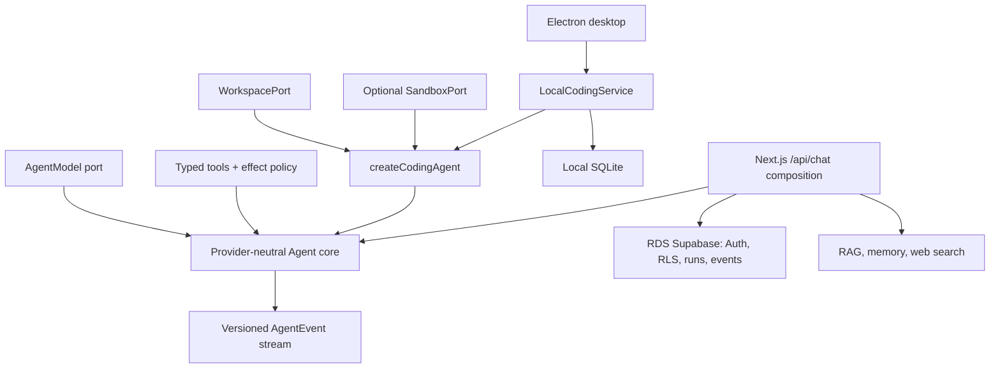

# Brace: local-first desktop coding agent

**English** | [简体中文](README.zh-CN.md)

[](https://github.com/Whiskeyi/brace/actions/workflows/ci.yml)
[](LICENSE)
[](package.json)

Brace is a Codex-style desktop coding client backed by a provider-neutral agent runtime. The Electron client opens local repositories, runs bounded coding tasks, pauses for write/command approval, persists task history to local SQLite, and can isolate work in Git worktrees. The existing Next.js/Supabase application remains available as an optional cloud control plane and web-chat adapter.

[MIT licensed](LICENSE). This is an independent community project and is not affiliated with or endorsed by Alibaba Cloud or Supabase.

The repository has three deliberately separate composition roots:

- `createCodingAgent` is the headless coding-agent entry point. A host injects a model, a `WorkspacePort`, and optionally a `SandboxPort`; the composition supplies the coding prompt, tools, and fail-closed effect policy.
- `LocalCodingService` powers the Electron desktop client. It owns projects, threads, local SQLite runs/events, interactive approvals, worktrees, cancellation, and the IPC-facing application API.
- `createServerAgent` powers the included authenticated web chat. It mounts time/calculator plus configured RAG, memory, and web-search tools. **`POST /api/chat` does not mount the local workspace or local process adapter.**

See [the architecture guide](docs/architecture.md) for lifecycle, persistence, and trust-boundary details.

## What is implemented

| Area | Implementation |
| --- | --- |
| Agent core | `AgentModel` and tool ports, fragmented tool-call/reasoning assembly, cancellation, bounded rounds/calls/concurrency/model bytes/chunks, per-round context compaction, timeouts, argument/result byte limits, and isolated tool failures |
| Model adapters | Provider-neutral core plus an OpenAI-compatible Chat Completions adapter and presets for Qwen/Bailian, MiniMax, Kimi Code, DeepSeek, GLM, and custom compatible endpoints |
| Coding workspace | Root-confined list, literal search, UTF-8 read, optimistic atomic replace/create, compare-and-delete, and no-overwrite move/rename through `WorkspacePort` |
| Controlled execution | Optional `SandboxPort`, direct executable plus argv calls, and fixed Git status/diff inspection tools behind execute authorization |
| Tool authorization | Trusted `effect` annotations, exact preauthorization for headless hosts, and durable allow-once/deny approval in the desktop host |
| Event protocol | Versioned, sequenced `start`, `delta`, `tool_call`, `tool_result`, `usage`, `done`, and `error` events over SSE |
| Desktop client | Electron shell, native macOS material/menu/shortcuts, context-isolated IPC, project-scoped drafts, window-level task restoration/cancellation, complete workspace change inventory, approvals, notifications, native folder selection, and a guarded local Web preview in the center workspace |
| Local durability | SQLite projects, task threads, messages, runs, ordered events, approvals, and interrupted-run recovery |
| Worktree isolation | New desktop tasks can use the selected checkout or a named managed Git worktree branch, then safely apply or discard it |
| Durable runs | Ordered append-only event log, persisted tool steps, idempotent completed-run replay, heartbeat, and one active run per conversation |
| Context | Root `AGENTS.md` / `CLAUDE.md` guidance plus newest complete turns, with conservative budgets checked again before every model round |
| Identity and isolation | Supabase email Auth, server-side token verification, a server-only Service Role data plane, RLS, and explicit `user_id` predicates in repositories |
| Optional data tools | Alibaba Cloud RAG Agent, RDS mem0 or app-owned memory, and Tavily/Brave search |
| Delivery | Responsive Next.js UI, standalone build, multi-stage Dockerfile, liveness and dependency-readiness endpoints |

## Architecture at a glance



The core does not read environment variables, choose tenants, or open a workspace. Those decisions belong to a trusted composition root.

## Prerequisites

- Node.js 22.12 or newer
- pnpm 11
- For the web application: an Alibaba Cloud RDS AI Application Platform project with Supabase enabled
- An OpenAI-compatible model API key, or another `AgentModel` implementation

Do not delete or modify databases and accounts created automatically by the platform.

## Run the desktop client

Desktop mode is local-first and does not require Supabase. The client defaults to English and can switch to Simplified Chinese at runtime. Its appearance can follow the system setting or use Light or Dark mode, with a choice of accent colors. Launch the application, open **Settings**, choose a provider preset (or **Custom OpenAI-Compatible Endpoint**), enter the model and matching API key, then use **Test Connection** before saving. On macOS, a saved key is encrypted through the system Keychain-backed Electron `safeStorage` API and is never exposed to the renderer. Brace does not touch Keychain merely to render settings, and caches a successful decrypt for the lifetime of the desktop process; macOS may still request authorization once when a saved key is first read or replaced. Stable Developer ID signing is required to preserve that trust reliably across rebuilt application bundles.

For source development and CI, environment variables remain a supported fallback:

```bash
cp .env.example .env.local
```

```dotenv
LLM_PROVIDER=bailian-payg
LLM_BASE_URL=https://dashscope.aliyuncs.com/compatible-mode/v1
LLM_API_KEY=your-model-api-key
LLM_MODEL=qwen-plus
```

Then install and launch:

```bash
pnpm install
pnpm desktop:dev
```

The desktop application stores its SQLite database, encrypted model settings, and managed worktrees below the operating system's application data directory. Open a local repository, choose **Current Directory** or **Isolated Worktree**, and submit a task. Root `AGENTS.md` and `CLAUDE.md` files are loaded as bounded, repository-scoped guidance below the host policy and user request. Read tools run inside the selected workspace; file writes and allowlisted process execution pause for an explicit allow-once or deny decision. The Inspector can be toggled with `Cmd/Ctrl+Shift+I`, and pending approvals route to the owning task. For an isolated task, the Inspector shows its named branch and lets you explicitly **Apply** its changes back as an uncommitted main-project diff or **Discard** them. Creating or applying isolation fails closed when the main checkout is dirty or has moved from the task's recorded base; ignored files and submodule/gitlink changes are preserved instead of silently dropped. If apply succeeds but cleanup does not, the exact applied commit is persisted and the Inspector exposes a restart-safe **Retry cleanup** action instead of permitting a second apply. Closing only the window can leave an active task running in the same process; reopening it from the Dock restores that task. A full process restart does not replay side effects: it marks interrupted runs failed and pending approvals cancelled. A project currently runs one task at a time; other projects may run independently.

### Model providers, plans, and connection testing

All built-in choices currently use the same OpenAI-compatible **Chat Completions streaming** adapter. The model field remains editable because provider catalogs change independently of Brace; the listed model is the registry default at this revision, not a hard allowlist.

| Provider ID | Default preset endpoint | Registry default | Credential/product boundary |
| --- | --- | --- | --- |
| `bailian-payg` | `https://dashscope.aliyuncs.com/compatible-mode/v1` | `qwen-plus` | Bailian pay-as-you-go key |
| `bailian-coding-plan` | `https://coding.dashscope.aliyuncs.com/v1` | `qwen3-coder-plus` | Coding Plan key (`sk-sp-*`); intended for interactive coding tools, not backend/batch workloads |
| `minimax-cn-token-plan` | `https://api.minimaxi.com/v1` | `MiniMax-M3` | MiniMax China Token Plan key |
| `minimax-global-token-plan` | `https://api.minimax.io/v1` | `MiniMax-M3` | MiniMax Global Token Plan key |
| `kimi-code` | `https://api.kimi.com/coding/v1` | `kimi-for-coding` | Kimi Code membership key; Brace keeps its own client identity |
| `deepseek` | `https://api.deepseek.com` | `deepseek-v4-flash` | DeepSeek open-platform pay-as-you-go key |
| `glm-payg` | `https://open.bigmodel.cn/api/paas/v4` | `glm-5.2` | Zhipu open-platform pay-as-you-go key |
| `glm-coding-plan` | `https://open.bigmodel.cn/api/coding/paas/v4` | `glm-5.2` | GLM Coding Plan key; see the eligibility limitation below |
| `custom` | Editable; defaults to `https://api.openai.com/v1` | `gpt-4.1-mini` | Key is scoped to the normalized custom endpoint |

Most desktop preset endpoints are read-only. Bailian pay-as-you-go and Coding Plan fields also accept recognized official regional endpoints; an address that does not belong to the selected provider/plan is rejected. Custom endpoints must use HTTPS, except that loopback hosts (`localhost`, `*.localhost`, `127.0.0.0/8`, or `::1`) may use HTTP for local development. URLs containing credentials, query parameters, or fragments are rejected.

Desktop settings, environment-driven desktop configuration, and Web configuration preserve an official regional endpoint when it is recognized as the selected provider—for example, Bailian's international Coding Plan, US pay-as-you-go, or workspace-scoped Singapore endpoint. Region-specific URLs receive separate credential scopes. An unrelated URL is never accepted under a preset provider; use `custom` explicitly instead.

Provider request profiles keep the core neutral while adapting wire details: MiniMax and Kimi use `max_completion_tokens`, Qwen can request streamed usage, GLM enables streamed tool output, and generic custom endpoints omit optional stream fields that commonly break partial OpenAI-compatible implementations. DeepSeek/Kimi `reasoning_content` is preserved across tool rounds, and non-success finish reasons become explicit errors instead of false `done` events.

Subscription-plan, pay-as-you-go, region, and custom-endpoint keys occupy separate credential scopes. Changing scopes never silently sends the saved key to the new endpoint: enter a matching new key or explicitly remove the old one. An `LLM_API_KEY` environment fallback is likewise reused only when its configured provider/endpoint scope matches the saved desktop selection.

**Test Connection** resolves the unsaved form values without persisting them and sends a no-side-effect streamed function-call probe with a 30-second maximum. It leaves `tool_choice` on automatic for thinking-model compatibility, reserves at least 1,024 output tokens (4,096 for Kimi), and validates both the tool-call schema and `finish_reason`. A successful test proves that this endpoint/key/model combination emitted a valid tool call—the minimum capability needed by the coding agent. It does not guarantee remaining quota, every future tool call, or future provider availability. HTTP `401`, `403`, `404`, and `429` responses are surfaced as credential, entitlement, endpoint/model, and quota/rate-limit guidance.

GLM's Coding Plan documentation limits plan benefits to officially supported designated tools. Brace can speak to the Coding Plan-compatible endpoint but cannot claim official-tool status or guarantee that a request consumes plan quota; use `glm-payg` when that eligibility is required. Provider plans may also issue product-specific keys and quotas, so do not substitute a general open-platform key for a plan key.

The built-in adapter does not implement the Anthropic Messages protocol. A provider is usable through `custom` only when its endpoint implements the OpenAI-compatible Chat Completions streaming/tool-call contract; a native Anthropic endpoint requires a separate `AgentModel` adapter.

### Preview a local Web application

The center workspace includes a real iframe preview rather than a screenshot or status placeholder. Start the selected project's development server yourself first—for example, run `pnpm dev` in its terminal—then open the preview from the toolbar or **View → Toggle Local Preview** and enter an address such as `http://localhost:3000`. `Cmd/Ctrl+Shift+P` toggles between the task timeline and the preview without stopping the loaded page.

Preview navigation accepts only plain HTTP URLs whose host is exactly `localhost` or `127.0.0.1`. Navigation or redirects to external hosts are blocked, new windows/popups are denied, and browser permission requests are rejected. The iframe also runs with a restricted sandbox. This navigation boundary does not rewrite the application being previewed: its own `fetch`, image, and script requests remain governed by that application's CSP, browser CORS rules, and server configuration. A local app can therefore still call Supabase or another remote API when its own configuration permits it, although popup- or external-redirect-based flows remain unavailable inside the preview.

The address is remembered separately for each opened project. Use the refresh control to reload the current page, the close control to stop and unload the iframe while retaining the saved address, and **Reload** to retry after a connection, timeout, or blocked-navigation error. Brace does not detect or start a development server automatically.

Create a platform-native application directory with:

```bash
pnpm desktop:dist
```

The output is written below `release/` (for example, `release/Brace-darwin-arm64/Brace.app`). Packaging disables Electron's Run-as-Node, `NODE_OPTIONS`, and CLI-inspection fuse paths, enables cookie encryption and embedded ASAR integrity, and only loads application code from `app.asar`. A macOS local build then receives a complete ad-hoc signature and must pass strict bundle verification. Developer ID signing, notarization, DMG, and Windows installer creation still belong in the release pipeline and are not performed by the local build.

When an Electron archive is already cached, packaging can remain fully offline:

```bash
ELECTRON_ZIP_DIR=/absolute/path/to/electron-cache pnpm desktop:dist
```

The renderer has no Node integration and receives only a narrow IPC bridge plus non-secret model configuration metadata. `SUPABASE_SERVICE_ROLE_KEY` and the model API key are not read by or exposed to the renderer, and Supabase is not required by the desktop client.

## Run the web application

Follow [the Alibaba Cloud setup checklist](docs/aliyun-setup.md), then configure the application:

```bash
cp .env.example .env.local
```

Required values:

```dotenv
NEXT_PUBLIC_SUPABASE_URL=https://your-supabase-endpoint.example.com
NEXT_PUBLIC_SUPABASE_ANON_KEY=your-anon-key
SUPABASE_SERVICE_ROLE_KEY=your-server-only-service-key

LLM_PROVIDER=bailian-payg
LLM_BASE_URL=https://dashscope.aliyuncs.com/compatible-mode/v1
LLM_API_KEY=your-model-api-key
LLM_MODEL=qwen-plus
```

Apply every file in `supabase/migrations` in lexical order. Existing installations must apply `003_run_events_and_consistency.sql` during a drained maintenance window; it retires duplicate legacy active runs, adds heartbeats and the ordered event log, restricts business-table writes to the Service Role, and installs transactional begin/append/recover/finalize functions.

Install and start:

```bash
pnpm install
pnpm dev
```

Open [http://localhost:3000](http://localhost:3000), create a Supabase Auth user, and start a conversation.

### Runtime limits

The main web guardrails are configured in `.env.local`:

```dotenv
AGENT_MAX_TOOL_ROUNDS=6
AGENT_MAX_TOOL_CALLS=32
AGENT_MAX_TOOL_CONCURRENCY=4
AGENT_MAX_MODEL_OUTPUT_BYTES=1048576
AGENT_MAX_TOOL_ARGUMENT_BYTES=32768
AGENT_MAX_TOOL_RESULT_BYTES=65536
AGENT_TOOL_TIMEOUT_MS=15000
AGENT_REQUEST_TIMEOUT_MS=120000
AGENT_MAX_HISTORY_MESSAGES=40
AGENT_CONTEXT_WINDOW_TOKENS=32768
LLM_MAX_OUTPUT_TOKENS=4096
```

The initial context builder reserves up to the configured output allowance (capped at half the context window) and uses a conservative UTF-8 estimate. Web history keeps complete successful turns; desktop history also records explicit failed/cancelled completions so the prior instruction remains visible without implying success. Before every later tool round, the core budgets messages, tool definitions, reasoning, options, and tool results again; it drops only whole oldest turns and fails before sending when the current tool sub-round cannot fit. The estimate is intentionally provider-independent rather than an exact tokenizer.

### Optional integrations

```dotenv
# RAG Agent: one to ten server-approved dataset IDs.
ALIYUN_RAG_BASE_URL=https://your-rds-ai-endpoint.example.com
ALIYUN_RAG_API_KEY=server-only-api-key
ALIYUN_RAG_DATASET_IDS=dataset-uuid-1,dataset-uuid-2
ALIYUN_RAG_MODE=mix

# Managed RDS long-term memory; app-owned tables are the fallback.
MEM0_HOST=https://your-rds-ai-endpoint.example.com/memory
MEM0_API_KEY=server-only-api-key
MEM0_ENABLE_GRAPH=false

# Configure only what is needed. Tavily takes precedence when both exist.
TAVILY_API_KEY=
BRAVE_SEARCH_API_KEY=
```

Set `NEXT_PUBLIC_APP_NAME` to customize the UI and server-agent prompt. Never put a ServiceKey, model key, RAG key, or mem0 key in a `NEXT_PUBLIC_*` variable. The API verifies the caller with the AnonKey/JWT client, then uses the required `SUPABASE_SERVICE_ROLE_KEY` only on the server; migration 003 removes authenticated browser DML privileges from application business tables.

## Use the headless coding agent

`createCodingAgent` owns the system prompt, tool set, and coding policy. A headless caller can preauthorize exact non-read tool names, while a trusted local host can inject `interactiveToolPolicy` to pause and resume individual restricted calls.

```ts
import { createCodingAgent } from "@/lib/coding-agent";
import {
  createOpenAICompatibleModel,
  createOpenAISdkClient,
} from "@/lib/agent";
import { createNodeWorkspace } from "@/lib/workspace";

const apiKey = process.env.LLM_API_KEY;
if (!apiKey) throw new Error("LLM_API_KEY is required");
const workspace = await createNodeWorkspace({ root: "/absolute/path/to/repo" });
const client = createOpenAISdkClient({
  apiKey,
  baseUrl: process.env.LLM_BASE_URL,
  timeoutMs: 120_000,
});
const modelProvider = createOpenAICompatibleModel(client, "qwen-plus");

const agent = createCodingAgent({
  modelProvider,
  workspace,
  maxRounds: 8,
  maxToolCalls: 32,
  maxToolConcurrency: 4,
});

for await (const event of agent.run({
  messages: [{ role: "user", content: "Inspect and fix the failing test." }],
  // Omit approvedTools for a read-only run. A trusted host, not the model,
  // must produce this exact list.
  metadata: { approvedTools: ["apply_patch"] },
})) {
  // Persist, stream, or render the typed AgentEvent envelope.
  console.log(event);
}
```

The built-in workspace tools are `list_files`, `search_code`, `read_file`, `apply_patch`, `delete_file`, and `move_file`. `apply_patch` is an optimistic full-content replacement: `expectedContent` must exactly match the last-read content, or be `null` only when creating a new file. Delete and move operations likewise require the exact last-read content; moves never overwrite an existing destination.

Supplying a `SandboxPort` also adds `run_command`, `git_status`, and `git_diff`. The included Node adapter is useful only for a trusted local/development host:

```ts
import { createNodeProcessSandbox } from "@/lib/sandbox";

const sandbox = await createNodeProcessSandbox({
  root: "/absolute/path/to/repo",
  allowedExecutables: ["git", process.execPath],
});
```

The executable allowlist is empty by default. Calls use `spawn(executable, args)` with `shell: false`, a workspace-relative working directory, an environment-variable allowlist, timeout, cancellation, and a combined output cap.

All three sandbox-backed tools have effect `execute` and require their exact names in `approvedTools`. Git status/diff use fixed arguments and disable external diff, textconv, fsmonitor, and untracked-cache helpers; starting the host Git process is still execution, not ambient read access.

`approvedTools` remains deterministic preauthorization for non-interactive hosts. The desktop composition instead injects an interactive policy and persists pending/approved/denied/cancelled decisions in local SQLite. The model cannot create its own approval or label an untrusted tool as safe.

Authorizing `run_command` authorizes any executable/argument combination that the injected sandbox accepts for that run. Keep the sandbox allowlist narrow, and add argument-level policy in the host when exact-name authorization is too broad.

## Durable web-run lifecycle

The chat adapter validates an idempotency key and hashes the conversation/message payload. It then:

1. rejects reuse of the key with a different payload;
2. rejects another live run for the same conversation, or atomically fences and recovers an expired database lease;
3. atomically inserts the running run and user message through `agent_begin_run`;
4. streams and idempotently appends ordered `AgentEvent` envelopes while recording tool steps;
5. atomically writes the terminal event, terminal run projection, unfinished-step state, and assistant message through `agent_finalize_run`;
6. replays a completed run from its event log on a matching retry, with a projection fallback for older/corrupt logs.

The begin and finalize edges are transactional. Intermediate event batches and completed tool-step updates are separate durable writes, so this is not a single transaction spanning a model stream. Consecutive delta rows are coalesced in the durable log, while live SSE remains token/chunk granular.

## Health and deployment

Build and run the standalone image:

```bash
docker build \
  --build-arg NEXT_PUBLIC_SUPABASE_URL="https://your-supabase-endpoint.example.com" \
  --build-arg NEXT_PUBLIC_SUPABASE_ANON_KEY="your-anon-key" \
  --build-arg NEXT_PUBLIC_APP_NAME="Brace" \
  -t brace .
docker run --rm -p 3000:3000 --env-file .env.local brace
```

Next.js freezes `NEXT_PUBLIC_*` values into the browser bundle at build time, so the two required public Supabase build arguments must match the runtime `.env.local`. They are public client configuration; never pass the Service Role or model keys as Docker build arguments.

Configure orchestrator probes separately:

- `GET /api/health` is process liveness only and does not contact dependencies.
- `GET /api/health/ready` validates configuration and probes Supabase Auth, Service Role access to migration 003's event table, and the configured model endpoint's `/models` route; it returns `503` when any dependency is unavailable.

Some OpenAI-compatible providers do not expose `GET /models`. In that case, adapt the readiness probe for the provider instead of treating `/api/health` as dependency readiness.

For production, deploy to ECS, SAE, ACK, or another runtime in the same region/VPC as the RDS AI project. Store secrets in a secret manager, terminate TLS, restrict egress/whitelists, and set resource and cost limits.

## Verify

```bash
pnpm docs:check
pnpm typecheck
pnpm lint
pnpm test
pnpm test:coverage
pnpm build
pnpm desktop:build
pnpm audit --registry=https://registry.npmjs.org --prod
```

The dependency audit requires registry access.
CI also applies migrations `001` through `003` to PostgreSQL 16, exercises begin/append/finalize/recover idempotency and privilege invariants, builds the container, and packages the macOS desktop application. The macOS smoke test verifies the bundle signature, packaged icon, and a real application launch.

## Project layout

```text
src/lib/agent/                Provider-neutral runtime, model adapter, policy, SSE
src/lib/coding-agent/         Headless coding composition and exact-name policy
src/lib/local-agent/          Desktop application service, SQLite, approvals, worktrees
src/lib/workspace/            WorkspacePort and root-confined Node adapter
src/lib/sandbox/              SandboxPort and trusted-local Node process adapter
src/lib/tools/coding/         Workspace, command, and fixed Git tools
src/server/agent/             Web-chat model/tool composition
src/server/chat/              Command, context, recording, replay, and streaming
src/lib/repositories/         Tenant-scoped Supabase repositories
src/lib/integrations/         RAG Agent, mem0, Tavily, and Brave adapters
src/app/                      Next.js UI and API routes
desktop/                      Electron main/preload process and local client UI
scripts/build-desktop.mjs     Bundled desktop build entry point
scripts/package-desktop.mjs   Hardened native desktop packaging and verification
scripts/check-readme-parity.mjs  English/Chinese documentation parity gate
supabase/migrations/          Schema, RLS, audit, Storage, and run-event migration
tests/                        Runtime, workspace, sandbox, persistence, and protocol tests
```

## Security boundary and known limits

- Browser code receives only the Supabase URL and AnonKey. User JWTs are verified through Supabase Auth; the server-only Service Role performs application-table access, and repositories always add explicit owner predicates.
- Tool descriptions and model output are untrusted. Authorization uses host-supplied annotations and metadata; policy failures deny execution.
- Read-only coding tools are ambient in `createCodingAgent`; `write`, `execute`, and `network` effects require exact preauthorization or a trusted host's interactive decision.
- `NodeWorkspace` rejects parent/absolute/symlink traversal, hides common credential paths by default, bounds text/file/output sizes, and serializes optimistic writes. Its path checks cannot eliminate directory-swap TOCTOU on portable Node APIs, so it is a trusted-local filesystem adapter, not an OS or tenant security boundary.
- `NodeProcessSandbox` constrains a host process but is **not a security sandbox**. Do not use it for untrusted users or multi-tenant production execution.
- Production coding execution requires a separately isolated container/VM/managed sandbox and a per-run or per-tenant workspace implementation behind the ports. Network and credential scopes must be enforced there.
- The included web chat does not expose local code or shell access. Wiring a workspace into an HTTP route is a separate deployment decision and must not reuse a shared host checkout across tenants.
- Memory writes require explicit user intent and reject common secret patterns, but this is a guardrail rather than a complete data-loss-prevention system.
- Desktop approvals survive in the local audit history, but an application restart cancels pending decisions and marks interrupted runs failed rather than automatically resuming model execution.
- Desktop threads currently remain local. Supabase continues to power the web/cloud composition; cross-device task synchronization and remote sandbox provisioning are intentionally separate control-plane work.

## Official references

- [Alibaba Cloud RDS Supabase](https://help.aliyun.com/zh/rds/apsaradb-rds-for-postgresql/supabase/)
- [RDS Supabase SDK guide](https://help.aliyun.com/zh/rds/apsaradb-rds-for-postgresql/use-rds-supabase-sdks)
- [RAG Agent](https://help.aliyun.com/zh/rds/apsaradb-rds-for-postgresql/rag-agent/)
- [RAG Agent data-plane API](https://help.aliyun.com/zh/rds/apsaradb-rds-for-postgresql/rag-agent-data-plane-api-reference)
- [RDS long-term memory](https://help.aliyun.com/zh/rds/apsaradb-rds-for-postgresql/long-term-memory)
- [Sandbox and edge functions](https://help.aliyun.com/zh/rds/apsaradb-rds-for-postgresql/using-sandboxes-and-edge-functions)
- [Bailian Coding Plan: other coding tools](https://help.aliyun.com/zh/model-studio/other-tools-token-plan)
- [MiniMax Token Plan](https://platform.minimaxi.com/docs/token-plan/quickstart)
- [Kimi Code models](https://www.kimi.com/code/docs/en/kimi-code/models.html)
- [DeepSeek API quick start](https://api-docs.deepseek.com/)
- [GLM Coding Plan quick start](https://docs.bigmodel.cn/cn/coding-plan/quick-start)
- [GLM Coding Plan FAQ](https://docs.bigmodel.cn/cn/coding-plan/faq)

## Contributing, security, and license

Read [CONTRIBUTING.md](CONTRIBUTING.md) before opening a pull request. Report vulnerabilities privately according to [SECURITY.md](SECURITY.md), not in a public issue.

Released under the [MIT License](LICENSE).
