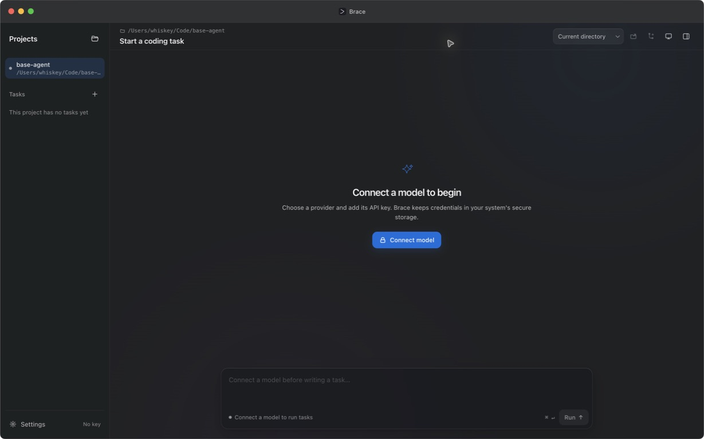
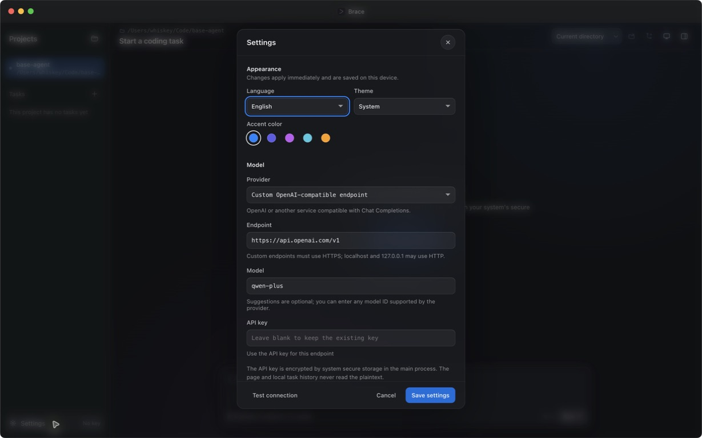
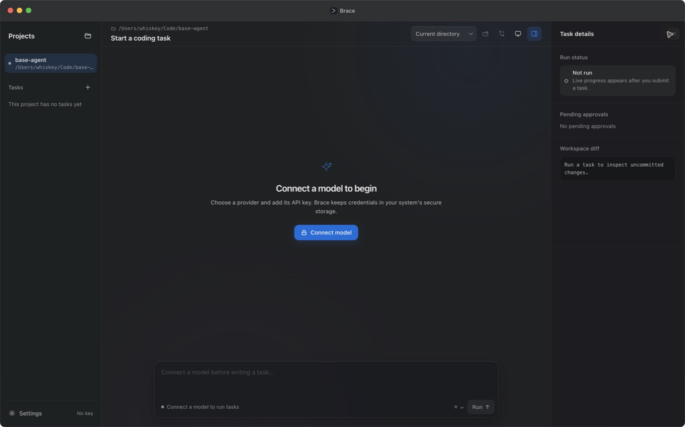
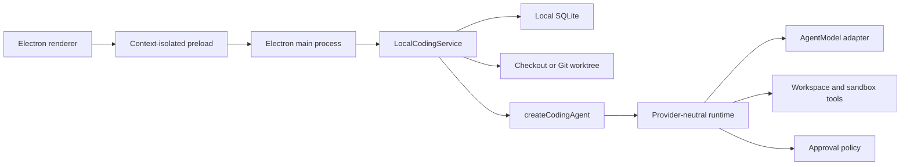

# Brace: local-first Electron coding agent

**English** | [简体中文](README.zh-CN.md)

[](https://github.com/Whiskeyi/brace/actions/workflows/ci.yml)
[](LICENSE)
[](package.json)

Brace is a pure Electron coding client. It opens local repositories, runs bounded agent loops, pauses before sensitive actions, persists task history to local SQLite, and can isolate work in managed Git worktrees. Execution and persistence stay on the local machine.

The application defaults to English and includes Simplified Chinese, light/dark/system themes, configurable accent colors, and provider presets for popular OpenAI-compatible coding models.

## Desktop preview

<p align="center">
  
</p>

<p align="center">
  
  
</p>

## What is included

| Area | Implementation |
| --- | --- |
| Desktop shell | Sandboxed Electron renderer, context-isolated preload bridge, native menus, shortcuts, notifications, folder selection, and secure model settings |
| Agent runtime | Provider-neutral streamed model loop with bounded rounds, calls, concurrency, context, output, timeouts, cancellation, and typed events |
| Coding tools | Root-confined file listing, search, read, optimistic atomic writes, compare-and-delete, move, commands, and fixed Git inspection |
| Local persistence | SQLite projects, threads, messages, runs, ordered events, approvals, and interrupted-run recovery |
| Approvals | Read-only ambient access; write, execute, and network effects require an exact trusted tool and explicit authorization |
| Worktree isolation | Per-task managed Git branches with inspected apply, discard, and restart-safe cleanup flows |
| Local preview | Loopback-only Web preview with blocked popups, external navigation, redirects, downloads, and browser permissions |
| Model providers | Bailian/Qwen, MiniMax, Kimi Code, DeepSeek, GLM, and editable custom OpenAI-compatible endpoints |
| Delivery | esbuild desktop bundles, hardened Electron fuses, ASAR packaging, macOS icon/signature checks, and GitHub Actions CI |

## Architecture



The renderer has no Node.js integration and never receives the model API key. Electron Main validates the IPC surface, owns secure storage and local persistence, and composes `LocalCodingService`. The coding runtime depends on capability contracts rather than Electron or the filesystem directly.

See the [architecture guide](docs/architecture.md) for the task lifecycle, trust boundaries, worktree invariants, and provider adapter contract.

## Requirements

- Node.js 22.13 or newer, excluding Node.js 23
- pnpm 11
- A model endpoint and API key supported by one of the provider presets or the custom OpenAI-compatible profile
- Git for worktree mode and workspace diff inspection

## Run locally

```bash
pnpm install --frozen-lockfile
cp .env.example .env.local
pnpm dev
```

Model settings can be entered inside the application, so `.env.local` is optional. On macOS, saved keys are encrypted through Electron `safeStorage`, backed by Keychain.

Build the desktop bundle without launching it:

```bash
pnpm build
```

Package the application for the current operating system:

```bash
pnpm dist
```

## Model providers

The provider registry currently includes Bailian pay-as-you-go and Coding Plan, MiniMax China and global Token Plans, Kimi Code, DeepSeek, GLM pay-as-you-go and Coding Plan, plus `custom`.

All current presets use streamed OpenAI-compatible Chat Completions with tool calling. Provider profiles adapt endpoint, output-token parameter, streamed usage, tool streaming, prompt caching, and credential scope. Recommended model identifiers are suggestions; the settings field remains editable.

## Safety model

- Filesystem operations are confined to the canonical project or managed worktree root. Sensitive paths and symlink escapes fail closed.
- File writes use optimistic content matching and atomic replacement. Deletes require an exact content match.
- Commands use an executable allowlist, argv execution without a shell, a reduced environment, bounded output, and timeouts.
- Read tools are ambient. Write, execute, and network tools pause for approval unless the trusted host preauthorizes the exact tool name.
- The local process boundary is not container or VM isolation. Only open repositories and approve commands that you trust.
- One task may run per project; different projects can run independently.

## Verify

```bash
pnpm docs:check
pnpm typecheck
pnpm lint
pnpm test:coverage
pnpm build
```

On macOS, use `pnpm dist` after changes to packaging, icons, signing, or application metadata.

## Project layout

```text
desktop/                       Electron main, preload, renderer, preferences
src/lib/agent/                Provider-neutral model and tool loop
src/lib/coding-agent/         Coding prompt, tool composition, approval policy
src/lib/local-agent/          SQLite task service, approvals, context, worktrees
src/lib/model-providers.ts    Provider profiles and endpoint policy
src/lib/workspace/            Workspace contract and local adapter
src/lib/sandbox/              Process contract and local adapter
src/lib/tools/coding/         File, command, and fixed Git tools
scripts/                       Desktop build, package, and documentation checks
tests/                         Runtime, desktop, workspace, sandbox, and worktree tests
```

## Contributing and license

See [CONTRIBUTING.md](CONTRIBUTING.md), [SECURITY.md](SECURITY.md), and [CODE_OF_CONDUCT.md](CODE_OF_CONDUCT.md). Brace is available under the [MIT License](LICENSE).
