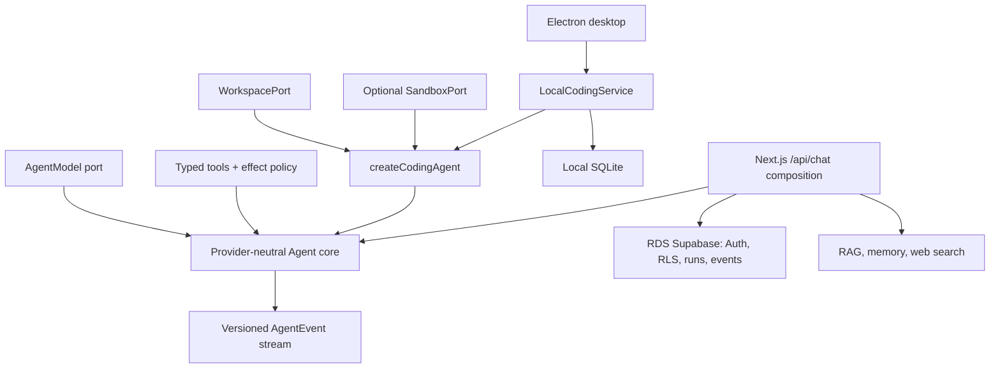

# Brace：本地优先的桌面编码智能体

[English](README.md) | **简体中文**

[](https://github.com/Whiskeyi/brace/actions/workflows/ci.yml)
[](LICENSE)
[](package.json)

Brace 是一个 Codex 风格的桌面编码客户端，由与提供商无关的智能体运行时提供支持。Electron 客户端可打开本地仓库、执行有边界的编码任务、在写入或执行命令前暂停请求授权、将任务历史持久化到本地 SQLite，并可在 Git worktree 中隔离工作。现有的 Next.js/Supabase 应用仍可作为可选的云端控制平面和网页聊天适配器使用。

[MIT licensed](LICENSE)。这是独立的社区项目，与阿里云或 Supabase 没有隶属或背书关系。

仓库包含三个刻意分离的组合根：

- `createCodingAgent` 是无界面 coding-agent 的入口。宿主注入模型、`WorkspacePort`，以及可选的 `SandboxPort`；该组合提供编码提示词、工具和默认拒绝的 effect 策略。
- `LocalCodingService` 为 Electron 桌面客户端提供支持。它管理项目、线程、本地 SQLite 运行/事件、交互式授权、worktree、取消以及面向 IPC 的应用 API。
- `createServerAgent` 为内置的已认证网页聊天提供支持。它挂载时间/计算器以及已配置的 RAG、记忆和网页搜索工具。**`POST /api/chat` 不会挂载本地工作区或本地进程适配器。**

有关生命周期、持久化和信任边界，请参阅[架构指南](docs/architecture.md)。

## 已实现的功能

| 范围 | 实现 |
| --- | --- |
| 智能体核心 | `AgentModel` 和工具端口、分片工具调用/推理组装、取消、有边界的轮次/调用/并发/模型字节/分片、逐轮上下文压缩、超时、参数/结果字节上限以及隔离的工具失败 |
| 模型适配器 | 与提供商无关的核心，外加 OpenAI-compatible Chat Completions 适配器，以及 Qwen/Bailian、MiniMax、Kimi Code、DeepSeek、GLM 和自定义兼容端点的预设 |
| 编码工作区 | 通过 `WorkspacePort` 提供根目录约束的列表、字面搜索、UTF-8 读取、乐观原子替换/创建、内容复核删除和禁止覆盖的移动/重命名 |
| 受控执行 | 可选 `SandboxPort`、直接可执行文件加 argv 调用，以及受执行授权保护的固定 Git status/diff 检查工具 |
| 工具授权 | 受信任的 `effect` 注解、无界面宿主的精确预授权，以及桌面宿主中持久化的仅本次允许/拒绝授权 |
| 事件协议 | 通过 SSE 传输的有版本、带序号的 `start`、`delta`、`tool_call`、`tool_result`、`usage`、`done` 和 `error` 事件 |
| 桌面客户端 | Electron shell、原生 macOS 材质/菜单/快捷键、上下文隔离 IPC、项目级草稿、窗口级任务恢复/取消、完整工作区变更清单、授权、通知、原生文件夹选择，以及中心工作区中受保护的本地 Web 预览 |
| 本地持久化 | SQLite 项目、任务线程、消息、运行、有序事件、授权和中断运行恢复 |
| Worktree 隔离 | 新建桌面任务可使用所选检出目录或带命名分支的受管理 Git worktree，随后安全应用或丢弃 |
| 持久化运行 | 有序追加事件日志、持久化工具步骤、幂等的已完成运行回放、心跳，以及每个会话一个活跃运行 |
| 上下文 | 根目录 `AGENTS.md` / `CLAUDE.md` 指引加最新完整轮次，并在每个模型轮次前再次执行保守预算 |
| 身份与隔离 | Supabase 邮箱 Auth、服务端 token 验证、仅服务端的 Service Role 数据平面、RLS，以及仓库中的显式 `user_id` 谓词 |
| 可选数据工具 | 阿里云 RAG Agent、RDS mem0 或应用自有记忆，以及 Tavily/Brave 搜索 |
| 交付 | 响应式 Next.js UI、standalone 构建、多阶段 Dockerfile、存活和依赖就绪端点 |

## 架构概览



核心不会读取环境变量、选择租户或打开工作区。这些决策属于受信任的组合根。

## 前置条件

- Node.js 22.12 或更高版本
- pnpm 11
- 对于网页应用：已启用 Supabase 的阿里云 RDS AI Application Platform 项目
- OpenAI-compatible 模型 API key，或另一种 `AgentModel` 实现

请勿删除或修改平台自动创建的数据库和账户。

## 运行桌面客户端

桌面模式以本地优先，不需要 Supabase。客户端默认英文，并可在运行时切换为简体中文。外观可跟随系统设置，或使用浅色、深色模式，并提供多种主题色选择。启动应用，打开 **设置（Settings）**，选择提供商预设（或 **Custom OpenAI-Compatible Endpoint**），填写模型和匹配的 API key，然后在保存前使用 **测试连接（Test Connection）**。在 macOS 上，保存的 key 通过系统 Keychain 支持的 Electron `safeStorage` API 加密，绝不会暴露给 renderer。Brace 不会仅为渲染设置而访问 Keychain，并会在桌面进程生命周期内缓存成功解密的结果；当首次读取或替换已保存 key 时，macOS 仍可能请求一次授权。需要稳定的 Developer ID 签名，才能在重建的应用 bundle 间可靠地维持该信任。

对于源代码开发和 CI，环境变量仍是支持的回退方式：

```bash
cp .env.example .env.local
```

```dotenv
LLM_PROVIDER=bailian-payg
LLM_BASE_URL=https://dashscope.aliyuncs.com/compatible-mode/v1
LLM_API_KEY=your-model-api-key
LLM_MODEL=qwen-plus
```

随后安装并启动：

```bash
pnpm install
pnpm desktop:dev
```

桌面应用将 SQLite 数据库、加密的模型设置和受管理 worktree 存储在操作系统应用数据目录下。打开一个本地仓库，选择 **当前目录** 或 **隔离 Worktree**，然后提交任务。根目录的 `AGENTS.md` 和 `CLAUDE.md` 会作为有大小边界的仓库级指引加载，其优先级低于宿主策略和用户请求。读取工具在所选工作区内运行；文件写入和允许列表中的进程执行会暂停，等待明确的仅本次允许或拒绝决定。可通过 `Cmd/Ctrl+Shift+I` 切换 Inspector，待处理授权会路由至所属任务。对于隔离任务，Inspector 会显示其命名分支，并允许你明确选择**应用**，将变更作为主项目中的未提交 diff 带回，或选择**丢弃**。主 checkout 有改动或偏离任务基准时，创建/应用隔离都会安全拒绝；ignored 文件与 submodule/gitlink 变更会被保留，而不是静默丢失。如果应用成功但清理失败，客户端会持久化精确的已应用 commit，并在 Inspector 提供可跨重启的**重试清理**，而不会允许再次应用。仅关闭窗口可使活跃任务在同一进程中继续运行；从 Dock 重新打开会恢复该任务。完整进程重启不会回放副作用：它会将中断运行标记为失败，并将待处理授权标记为已取消。一个项目当前一次只能运行一个任务；其他项目可独立运行。

### 模型提供商、计划与连接测试

所有内置选项目前都使用相同的 OpenAI-compatible **Chat Completions streaming** 适配器。模型字段保持可编辑，因为提供商目录独立于 Brace 变化；所列模型是此修订版的注册表默认值，并非硬性允许列表。

| Provider ID | Default preset endpoint | Registry default | Credential/product boundary |
| --- | --- | --- | --- |
| `bailian-payg` | `https://dashscope.aliyuncs.com/compatible-mode/v1` | `qwen-plus` | Bailian pay-as-you-go key |
| `bailian-coding-plan` | `https://coding.dashscope.aliyuncs.com/v1` | `qwen3-coder-plus` | Coding Plan key (`sk-sp-*`); intended for interactive coding tools, not backend/batch workloads |
| `minimax-cn-token-plan` | `https://api.minimaxi.com/v1` | `MiniMax-M3` | MiniMax China Token Plan key |
| `minimax-global-token-plan` | `https://api.minimax.io/v1` | `MiniMax-M3` | MiniMax Global Token Plan key |
| `kimi-code` | `https://api.kimi.com/coding/v1` | `kimi-for-coding` | Kimi Code 会员 Key；Brace 保留自己的客户端身份 |
| `deepseek` | `https://api.deepseek.com` | `deepseek-v4-flash` | DeepSeek open-platform pay-as-you-go key |
| `glm-payg` | `https://open.bigmodel.cn/api/paas/v4` | `glm-5.2` | Zhipu open-platform pay-as-you-go key |
| `glm-coding-plan` | `https://open.bigmodel.cn/api/coding/paas/v4` | `glm-5.2` | GLM Coding Plan key; see the eligibility limitation below |
| `custom` | Editable; defaults to `https://api.openai.com/v1` | `gpt-4.1-mini` | Key is scoped to the normalized custom endpoint |

多数桌面预设接口为只读。百炼按量与 Coding Plan 也可填写已识别的官方地区接口；不属于所选供应商/套餐的地址会被拒绝。自定义端点必须使用 HTTPS；只有 loopback 主机（`localhost`、`*.localhost`、`127.0.0.0/8` 或 `::1`）可为本地开发使用 HTTP。包含凭据、查询参数或片段的 URL 会被拒绝。

桌面设置、环境变量驱动的桌面配置和 Web 配置，都会在地址被识别为所选提供商时保留官方区域端点，例如百炼国际站 Coding Plan、美国区按量端点或新加坡 workspace 端点。不同区域 URL 使用独立凭据作用域。预设提供商绝不会接受无关 URL；这种情况必须明确使用 `custom`。

Provider request profile 让核心保持中立，同时适配线路差异：MiniMax 与 Kimi 使用 `max_completion_tokens`，Qwen 可请求流式 usage，GLM 启用工具流式输出，而通用 custom 端点会省略经常导致部分 OpenAI-compatible 实现报错的可选 stream 字段。DeepSeek/Kimi 的 `reasoning_content` 会在工具轮次间保留，非成功结束原因会变成明确错误，而不是误报 `done`。

订阅计划、按量付费、区域和自定义端点 key 使用彼此分离的凭据作用域。更换作用域绝不会悄悄将已保存 key 发送到新端点：请填写匹配的新 key，或显式移除旧 key。仅当其配置的提供商/端点作用域与已保存的桌面选择一致时，`LLM_API_KEY` 环境回退也会被复用。

**测试连接**使用未保存的表单值而不持久化它们，并发送一个无副作用、最长 30 秒的流式 function-call 探针。为兼容思考模型，它保持 `tool_choice` 自动选择，至少预留 1,024 个输出 token（Kimi 为 4,096），并同时校验工具参数 schema 与 `finish_reason`。测试成功证明该端点/key/模型组合能够生成有效工具调用，这是 Coding Agent 所需的最低能力；它不保证剩余额度、之后的每次工具调用或提供商未来的可用性。HTTP `401`、`403`、`404` 和 `429` 响应会分别显示为凭据、权益、端点/模型和配额/限速指引。

GLM 的 Coding Plan 文档将计划权益限制在官方支持的指定工具中。Brace 可以连接 Coding Plan-compatible 端点，但不能声称具有官方工具资格，也不能保证请求消耗计划额度；当需要该资格时请使用 `glm-payg`。提供商计划也可能发放产品专用 key 和配额，因此不要用通用开放平台 key 替代计划 key。

内置适配器没有实现 Anthropic Messages 协议。只有当提供商端点实现 OpenAI-compatible Chat Completions streaming/tool-call 合约时，才可通过 `custom` 使用；原生 Anthropic 端点需要单独的 `AgentModel` 适配器。

### 预览本地 Web 应用

中心工作区包含真实 iframe 预览，而不是截图或状态占位符。请先自行启动所选项目的开发服务器——例如在其终端运行 `pnpm dev`——再从工具栏或 **View → Toggle Local Preview** 打开预览，并输入类似 `http://localhost:3000` 的地址。`Cmd/Ctrl+Shift+P` 可在任务时间线和预览之间切换，而不会停止已加载页面。

预览导航只接受主机严格为 `localhost` 或 `127.0.0.1` 的普通 HTTP URL。会阻止导航或重定向到外部主机，拒绝新窗口/弹窗，并拒绝浏览器权限请求。iframe 还在受限 sandbox 中运行。此导航边界不会改写被预览的应用：其自身的 `fetch`、图片和脚本请求仍受该应用的 CSP、浏览器 CORS 规则和服务器配置控制。因此，当本地应用自身配置允许时，它仍可以调用 Supabase 或其他远程 API，但基于弹窗或外部重定向的流程在预览内不可用。

地址会为每个已打开项目单独记住。使用刷新控件重新加载当前页面，使用关闭控件停止并卸载 iframe 但保留保存的地址，并在连接、超时或被阻止导航错误后使用 **Reload** 重试。Brace 不会自动检测或启动开发服务器。

使用以下命令创建平台原生应用目录：

```bash
pnpm desktop:dist
```

输出写入 `release/` 下方（例如 `release/Brace-darwin-arm64/Brace.app`）。打包会禁用 Electron 的 Run-as-Node、`NODE_OPTIONS` 和 CLI-inspection fuse 路径，启用 cookie 加密和嵌入式 ASAR 完整性，并只从 `app.asar` 加载应用代码。本地 macOS 构建随后会获得完整 ad-hoc 签名，并且必须通过严格 bundle 验证。Developer ID 签名、notarization、DMG 和 Windows installer 创建仍属于发布流水线，不由本地构建执行。

当 Electron archive 已缓存时，打包可以完全离线：

```bash
ELECTRON_ZIP_DIR=/absolute/path/to/electron-cache pnpm desktop:dist
```

renderer 没有 Node integration，只获得窄 IPC bridge 及不含机密的模型配置元数据。`SUPABASE_SERVICE_ROLE_KEY` 和模型 API key 不会被 renderer 读取或暴露，桌面客户端不需要 Supabase。

## 运行网页应用

遵循[阿里云配置清单](docs/aliyun-setup.md)，然后配置应用：

```bash
cp .env.example .env.local
```

必需值：

```dotenv
NEXT_PUBLIC_SUPABASE_URL=https://your-supabase-endpoint.example.com
NEXT_PUBLIC_SUPABASE_ANON_KEY=your-anon-key
SUPABASE_SERVICE_ROLE_KEY=your-server-only-service-key

LLM_PROVIDER=bailian-payg
LLM_BASE_URL=https://dashscope.aliyuncs.com/compatible-mode/v1
LLM_API_KEY=your-model-api-key
LLM_MODEL=qwen-plus
```

按字典顺序应用 `supabase/migrations` 中的每个文件。现有安装必须在已排空的维护窗口应用 `003_run_events_and_consistency.sql`；它会淘汰重复的旧活跃运行、添加心跳和有序事件日志、将业务表写入限制为 Service Role，并安装事务性的 begin/append/recover/finalize 函数。

安装并启动：

```bash
pnpm install
pnpm dev
```

打开 [http://localhost:3000](http://localhost:3000)，创建 Supabase Auth 用户，然后开始会话。

### 运行时限制

主要网页护栏在 `.env.local` 中配置：

```dotenv
AGENT_MAX_TOOL_ROUNDS=6
AGENT_MAX_TOOL_CALLS=32
AGENT_MAX_TOOL_CONCURRENCY=4
AGENT_MAX_MODEL_OUTPUT_BYTES=1048576
AGENT_MAX_TOOL_ARGUMENT_BYTES=32768
AGENT_MAX_TOOL_RESULT_BYTES=65536
AGENT_TOOL_TIMEOUT_MS=15000
AGENT_REQUEST_TIMEOUT_MS=120000
AGENT_MAX_HISTORY_MESSAGES=40
AGENT_CONTEXT_WINDOW_TOKENS=32768
LLM_MAX_OUTPUT_TOKENS=4096
```

初始上下文构建器会保留最多配置输出额度的空间（上限为上下文窗口的一半），并使用保守的 UTF-8 估算。Web 历史只保留完整成功轮次；桌面历史还会写入明确的失败/取消结果，使之前的指令仍可见且不会被误认为成功。后续每个工具轮次前，核心会再次预算消息、工具定义、推理、选项和工具结果；只整段丢弃最旧轮次，并在当前工具子轮次仍无法放入时先失败而不发送请求。该估算刻意保持供应商无关，而不是精确 tokenizer。

### 可选集成

```dotenv
# RAG Agent: one to ten server-approved dataset IDs.
ALIYUN_RAG_BASE_URL=https://your-rds-ai-endpoint.example.com
ALIYUN_RAG_API_KEY=server-only-api-key
ALIYUN_RAG_DATASET_IDS=dataset-uuid-1,dataset-uuid-2
ALIYUN_RAG_MODE=mix

# Managed RDS long-term memory; app-owned tables are the fallback.
MEM0_HOST=https://your-rds-ai-endpoint.example.com/memory
MEM0_API_KEY=server-only-api-key
MEM0_ENABLE_GRAPH=false

# Configure only what is needed. Tavily takes precedence when both exist.
TAVILY_API_KEY=
BRAVE_SEARCH_API_KEY=
```

设置 `NEXT_PUBLIC_APP_NAME` 可自定义 UI 和 server-agent prompt。绝不要将 ServiceKey、模型 key、RAG key 或 mem0 key 放入 `NEXT_PUBLIC_*` 变量。API 使用 AnonKey/JWT client 验证调用方，然后仅在服务端使用必需的 `SUPABASE_SERVICE_ROLE_KEY`；迁移 003 从应用业务表移除了已认证浏览器的 DML 权限。

## 使用无界面编码智能体

`createCodingAgent` 管理 system prompt、工具集和编码策略。无界面调用方可预授权精确的非读取工具名称，而受信任的本地宿主可注入 `interactiveToolPolicy` 来暂停并恢复各个受限制调用。

```ts
import { createCodingAgent } from "@/lib/coding-agent";
import {
  createOpenAICompatibleModel,
  createOpenAISdkClient,
} from "@/lib/agent";
import { createNodeWorkspace } from "@/lib/workspace";

const apiKey = process.env.LLM_API_KEY;
if (!apiKey) throw new Error("LLM_API_KEY is required");
const workspace = await createNodeWorkspace({ root: "/absolute/path/to/repo" });
const client = createOpenAISdkClient({
  apiKey,
  baseUrl: process.env.LLM_BASE_URL,
  timeoutMs: 120_000,
});
const modelProvider = createOpenAICompatibleModel(client, "qwen-plus");

const agent = createCodingAgent({
  modelProvider,
  workspace,
  maxRounds: 8,
  maxToolCalls: 32,
  maxToolConcurrency: 4,
});

for await (const event of agent.run({
  messages: [{ role: "user", content: "Inspect and fix the failing test." }],
  // Omit approvedTools for a read-only run. A trusted host, not the model,
  // must produce this exact list.
  metadata: { approvedTools: ["apply_patch"] },
})) {
  // Persist, stream, or render the typed AgentEvent envelope.
  console.log(event);
}
```

内置工作区工具为 `list_files`、`search_code`、`read_file`、`apply_patch`、`delete_file` 和 `move_file`。`apply_patch` 是乐观的完整内容替换：`expectedContent` 必须精确匹配最后读取的内容；仅创建新文件时可为 `null`。删除和移动操作也必须提供最后读取到的精确内容，且移动绝不会覆盖已有目标。

提供 `SandboxPort` 还会添加 `run_command`、`git_status` 和 `git_diff`。所附 Node 适配器仅适合受信任的本地/开发宿主：

```ts
import { createNodeProcessSandbox } from "@/lib/sandbox";

const sandbox = await createNodeProcessSandbox({
  root: "/absolute/path/to/repo",
  allowedExecutables: ["git", process.execPath],
});
```

可执行文件允许列表默认为空。调用使用 `spawn(executable, args)`，其中 `shell: false`，并带有相对工作区的工作目录、环境变量允许列表、超时、取消和合并输出上限。

所有三个 sandbox-backed 工具都具有 `execute` effect，并要求其精确名称位于 `approvedTools`。Git status/diff 使用固定参数，并禁用 external diff、textconv、fsmonitor 和 untracked-cache helpers；启动宿主 Git 进程仍属于执行，而非环境读取访问。

`approvedTools` 对非交互宿主保持确定性的预授权。桌面组合则注入交互式策略，并在本地 SQLite 中持久化 pending/approved/denied/cancelled 决策。模型无法创建自己的授权，或将不受信任的工具标记为安全。

授权 `run_command` 即授权注入的 sandbox 对该次运行接受的任意可执行文件/参数组合。请保持 sandbox 允许列表狭窄；当精确名称授权过宽时，应在宿主中添加参数级策略。

## 持久化网页运行生命周期

聊天适配器验证幂等键并哈希会话/消息负载。随后它：

1. 拒绝用不同负载复用该键；
2. 拒绝同一会话的另一活跃运行，或原子地围栏并恢复过期数据库租约；
3. 通过 `agent_begin_run` 原子插入运行中的 run 和用户消息；
4. 在记录工具步骤时，流式传输并幂等追加有序 `AgentEvent` envelope；
5. 通过 `agent_finalize_run` 原子写入终止事件、终止 run projection、未完成步骤状态和助手消息；
6. 在匹配重试时从事件日志回放已完成运行，并为较旧/损坏日志提供 projection 回退。

begin 和 finalize 边缘是事务性的。中间事件批次和已完成工具步骤更新是分离的持久化写入，因此这不是跨越模型流的单一事务。连续 delta 行在持久化日志中合并，而实时 SSE 保持 token/chunk 粒度。

## 健康检查与部署

构建并运行 standalone 镜像：

```bash
docker build \
  --build-arg NEXT_PUBLIC_SUPABASE_URL="https://your-supabase-endpoint.example.com" \
  --build-arg NEXT_PUBLIC_SUPABASE_ANON_KEY="your-anon-key" \
  --build-arg NEXT_PUBLIC_APP_NAME="Brace" \
  -t brace .
docker run --rm -p 3000:3000 --env-file .env.local brace
```

Next.js 会在构建时将 `NEXT_PUBLIC_*` 值冻结进浏览器 bundle，因此两个必需的公开 Supabase 构建参数必须与运行时 `.env.local` 一致。它们是公开客户端配置；绝不要把 Service Role 或模型 key 作为 Docker 构建参数传入。

单独配置编排器探针：

- `GET /api/health` 仅为进程存活检查，不会接触依赖。
- `GET /api/health/ready` 验证配置，并探测 Supabase Auth、Service Role 对迁移 003 事件表的访问以及已配置模型端点的 `/models` route；任一依赖不可用时返回 `503`。

某些 OpenAI-compatible 提供商不会公开 `GET /models`。在这种情况下，应为该提供商调整就绪探针，而不是将 `/api/health` 视为依赖就绪。

生产环境应部署到与 RDS AI 项目相同 region/VPC 的 ECS、SAE、ACK 或其他运行时。将机密存入 secret manager，终止 TLS，限制 egress/whitelists，并设置资源和成本上限。

## 验证

```bash
pnpm docs:check
pnpm typecheck
pnpm lint
pnpm test
pnpm test:coverage
pnpm build
pnpm desktop:build
pnpm audit --registry=https://registry.npmjs.org --prod
```

依赖审计需要 registry 访问。CI 也会将迁移 `001` 至 `003` 应用到 PostgreSQL 16，执行 begin/append/finalize/recover 幂等性和权限不变量，构建容器，并打包 macOS 桌面应用。macOS 烟测会验证 bundle 签名、打包图标和真实应用启动。

## 项目布局

```text
src/lib/agent/                Provider-neutral runtime, model adapter, policy, SSE
src/lib/coding-agent/         Headless coding composition and exact-name policy
src/lib/local-agent/          Desktop application service, SQLite, approvals, worktrees
src/lib/workspace/            WorkspacePort and root-confined Node adapter
src/lib/sandbox/              SandboxPort and trusted-local Node process adapter
src/lib/tools/coding/         Workspace, command, and fixed Git tools
src/server/agent/             Web-chat model/tool composition
src/server/chat/              Command, context, recording, replay, and streaming
src/lib/repositories/         Tenant-scoped Supabase repositories
src/lib/integrations/         RAG Agent, mem0, Tavily, and Brave adapters
src/app/                      Next.js UI and API routes
desktop/                      Electron main/preload process and local client UI
scripts/build-desktop.mjs     Bundled desktop build entry point
scripts/package-desktop.mjs   Hardened native desktop packaging and verification
scripts/check-readme-parity.mjs  English/Chinese documentation parity gate
supabase/migrations/          Schema, RLS, audit, Storage, and run-event migration
tests/                        Runtime, workspace, sandbox, persistence, and protocol tests
```

## 安全边界与已知限制

- 浏览器代码只接收 Supabase URL 和 AnonKey。用户 JWT 通过 Supabase Auth 验证；仅服务端的 Service Role 执行应用表访问，且仓库始终添加显式所有者谓词。
- 工具描述和模型输出均不受信任。授权使用宿主提供的注解和元数据；策略失败会拒绝执行。
- `createCodingAgent` 中的只读编码工具是环境可用的；`write`、`execute` 和 `network` effects 需要精确预授权或受信任宿主的交互式决定。
- `NodeWorkspace` 拒绝父级/绝对路径/符号链接遍历，默认隐藏常见凭据路径，限制文本/文件/输出大小，并串行化乐观写入。其路径检查无法在可移植 Node API 上消除目录替换 TOCTOU，因此它是受信任的本地文件系统适配器，而非 OS 或租户安全边界。
- `NodeProcessSandbox` 约束宿主进程，但**不是安全 sandbox**。不要将其用于不受信任用户或多租户生产执行。
- 生产编码执行需要独立隔离的 container/VM/managed sandbox，以及 ports 后的逐运行或逐租户工作区实现。必须在那里强制执行网络和凭据作用域。
- 内置网页聊天不会公开本地代码或 shell 访问。将工作区接入 HTTP route 是单独的部署决策，不得跨租户复用共享宿主检出目录。
- 记忆写入需要明确用户意图并拒绝常见 secret patterns，但这是护栏而不是完整的数据泄露防护系统。
- 桌面授权保存在本地审计历史中，但应用重启会取消待处理决定，并将中断运行标记为失败，而不会自动恢复模型执行。
- 桌面线程目前保持本地。Supabase 继续为网页/云端组合提供支持；跨设备任务同步和远程 sandbox 配置刻意作为独立的控制平面工作。

## 官方参考

- [Alibaba Cloud RDS Supabase](https://help.aliyun.com/zh/rds/apsaradb-rds-for-postgresql/supabase/)
- [RDS Supabase SDK guide](https://help.aliyun.com/zh/rds/apsaradb-rds-for-postgresql/use-rds-supabase-sdks)
- [RAG Agent](https://help.aliyun.com/zh/rds/apsaradb-rds-for-postgresql/rag-agent/)
- [RAG Agent data-plane API](https://help.aliyun.com/zh/rds/apsaradb-rds-for-postgresql/rag-agent-data-plane-api-reference)
- [RDS long-term memory](https://help.aliyun.com/zh/rds/apsaradb-rds-for-postgresql/long-term-memory)
- [Sandbox and edge functions](https://help.aliyun.com/zh/rds/apsaradb-rds-for-postgresql/using-sandboxes-and-edge-functions)
- [Bailian Coding Plan: other coding tools](https://help.aliyun.com/zh/model-studio/other-tools-token-plan)
- [MiniMax Token Plan](https://platform.minimaxi.com/docs/token-plan/quickstart)
- [Kimi Code models](https://www.kimi.com/code/docs/en/kimi-code/models.html)
- [DeepSeek API quick start](https://api-docs.deepseek.com/)
- [GLM Coding Plan quick start](https://docs.bigmodel.cn/cn/coding-plan/quick-start)
- [GLM Coding Plan FAQ](https://docs.bigmodel.cn/cn/coding-plan/faq)

## 贡献、安全与许可

在创建 pull request 前阅读 [CONTRIBUTING.md](CONTRIBUTING.md)。请按照 [SECURITY.md](SECURITY.md) 私下报告漏洞，不要发布在公开 issue 中。

基于 [MIT License](LICENSE) 发布。
