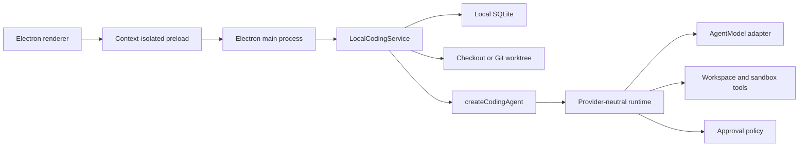

# Brace：本地优先的 Electron 编码智能体

[English](README.md) | **简体中文**

[](https://github.com/Whiskeyi/brace/actions/workflows/ci.yml)
[](LICENSE)
[](package.json)

Brace 是一个纯 Electron 编码客户端。它可以打开本地仓库、运行有边界的 Agent 循环、在敏感操作前暂停审批、将任务历史持久化到本地 SQLite，并通过受管理的 Git worktree 隔离任务。执行与持久化都留在本机。

应用默认使用英文，同时支持简体中文、浅色/深色/系统主题、多种强调色，以及常见 OpenAI-compatible 编码模型的提供商预设。

## 桌面界面

<p align="center">
  
</p>

<p align="center">
  
  
</p>

## 已实现

| 范围 | 实现 |
| --- | --- |
| 桌面外壳 | 沙箱化 Electron renderer、上下文隔离 Preload、原生菜单、快捷键、通知、文件夹选择和安全模型设置 |
| Agent 运行时 | 与提供商无关的流式模型循环，限制轮次、调用、并发、上下文、输出和超时，并支持取消与类型化事件 |
| 编码工具 | 根目录约束的文件列表、搜索、读取、乐观原子写入、内容复核删除、移动、命令和固定 Git 检查 |
| 本地持久化 | SQLite 项目、线程、消息、运行、有序事件、审批和中断运行恢复 |
| 审批 | 只读能力默认可用；写入、执行和网络 effect 必须来自可信工具并获得明确授权 |
| Worktree 隔离 | 每任务受管理 Git 分支，以及经过检查的应用、丢弃和可跨重启清理流程 |
| 本地预览 | 仅允许回环地址的 Web 预览，并阻止弹窗、外部导航、重定向、下载和浏览器权限 |
| 模型提供商 | 百炼/Qwen、MiniMax、Kimi Code、DeepSeek、GLM 和可编辑的自定义 OpenAI-compatible 端点 |
| 交付 | esbuild 桌面 bundle、加固 Electron fuse、ASAR 打包、macOS 图标/签名检查和 GitHub Actions CI |

## 架构



Renderer 没有 Node.js 集成，也不会收到模型 API key。Electron Main 负责校验 IPC、管理安全存储和本地持久化，并组合 `LocalCodingService`。编码运行时依赖能力契约，不直接依赖 Electron 或文件系统。

任务生命周期、信任边界、worktree 不变量和 provider adapter 契约见[架构指南](docs/architecture.md)。

## 环境要求

- Node.js 22.13 或更高版本，不支持 Node.js 23
- pnpm 11
- 提供商预设或自定义 OpenAI-compatible 配置支持的模型端点和 API key
- Worktree 模式和工作区差异检查需要 Git

## 本地运行

```bash
pnpm install --frozen-lockfile
cp .env.example .env.local
pnpm dev
```

模型设置可以直接在应用内填写，因此 `.env.local` 是可选的。在 macOS 上，保存的 key 通过 Electron `safeStorage` 加密，并由 Keychain 支持。

只构建桌面 bundle 而不启动应用：

```bash
pnpm build
```

为当前操作系统打包应用：

```bash
pnpm dist
```

## 模型提供商

提供商注册表目前包含百炼按量与 Coding Plan、MiniMax 中国和全球 Token Plan、Kimi Code、DeepSeek、GLM 按量与 Coding Plan，以及 `custom`。

当前所有预设都使用支持工具调用的流式 OpenAI-compatible Chat Completions。Provider profile 负责适配端点、输出 token 参数、流式 usage、工具流、Prompt Cache 和凭证作用域。推荐模型 ID 只是建议，设置字段仍可编辑。

## 安全模型

- 文件系统操作被限制在规范化后的项目根目录或受管理 worktree 根目录内；敏感路径和符号链接逃逸默认拒绝。
- 文件写入使用乐观内容匹配和原子替换；删除要求内容完全匹配。
- 命令使用可执行文件白名单、无 shell 的 argv 调用、精简环境变量、输出限制和超时。
- 读取工具默认允许；写入、执行和网络工具需要暂停审批，除非可信宿主精确预授权该工具名。
- 本地进程边界不是容器或虚拟机隔离。只应打开可信仓库并批准可信命令。
- 每个项目最多运行一个任务，不同项目可以独立运行。

## 验证

```bash
pnpm docs:check
pnpm typecheck
pnpm lint
pnpm test:coverage
pnpm build
```

修改打包、图标、签名或应用元数据后，请在 macOS 上运行 `pnpm dist`。

## 项目结构

```text
desktop/                       Electron main, preload, renderer, preferences
src/lib/agent/                Provider-neutral model and tool loop
src/lib/coding-agent/         Coding prompt, tool composition, approval policy
src/lib/local-agent/          SQLite task service, approvals, context, worktrees
src/lib/model-providers.ts    Provider profiles and endpoint policy
src/lib/workspace/            Workspace contract and local adapter
src/lib/sandbox/              Process contract and local adapter
src/lib/tools/coding/         File, command, and fixed Git tools
scripts/                       Desktop build, package, and documentation checks
tests/                         Runtime, desktop, workspace, sandbox, and worktree tests
```

## 贡献与许可

请参阅 [CONTRIBUTING.md](CONTRIBUTING.md)、[SECURITY.md](SECURITY.md) 和 [CODE_OF_CONDUCT.md](CODE_OF_CONDUCT.md)。Brace 使用 [MIT License](LICENSE)。
