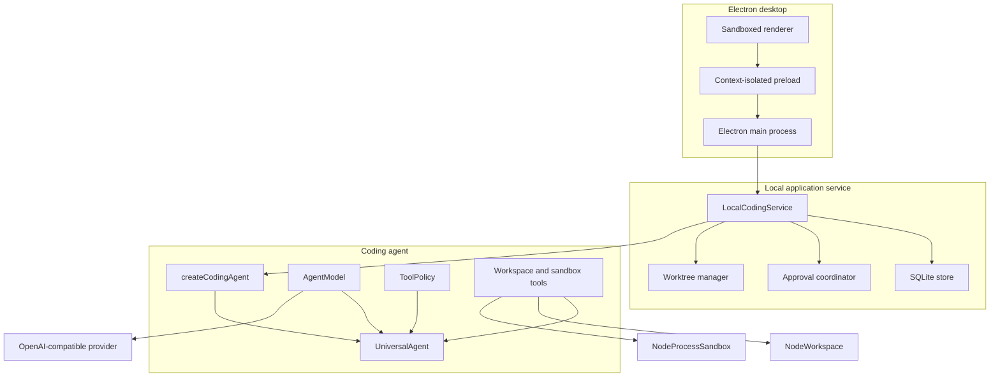
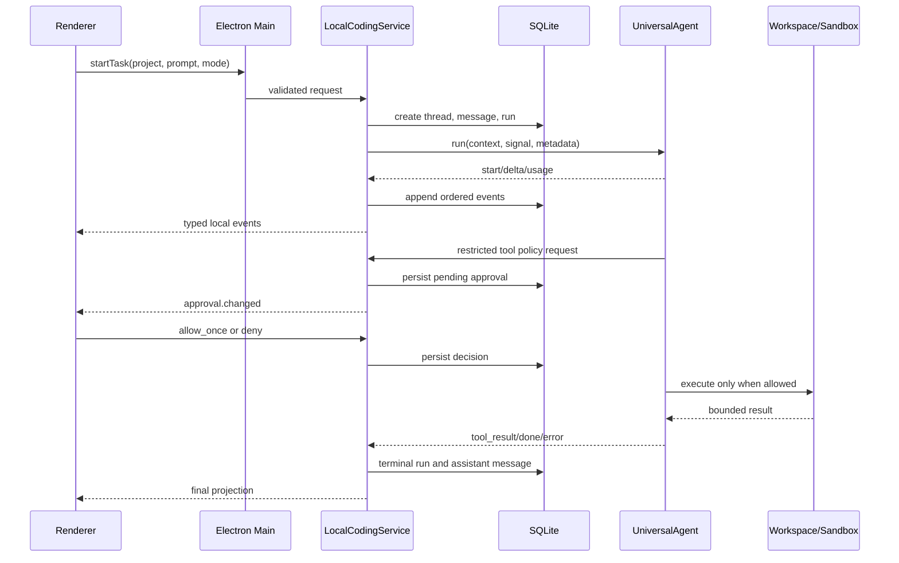

# Architecture

Brace is a local-first Electron application. Product code has one composition root: Electron Main creates `LocalCodingService`, which combines the provider-neutral agent runtime with local workspace, process, persistence, approval, and worktree adapters.

## System shape

Dependencies point inward. The desktop host depends on the local application service, the service composes the coding agent, and the coding agent depends only on the runtime and capability contracts. The core does not import Electron, SQLite, Node filesystem adapters, or process adapters.

## Layer responsibilities

| Layer | Code | Responsibility |
| --- | --- | --- |
| Desktop host | `desktop/main.ts`, `desktop/preload.ts` | Native window, menus, secure settings, trusted IPC, notifications, folder selection, preview navigation policy |
| Desktop renderer | `desktop/renderer` | Project/task UI, local snapshot projection, event timeline, approvals, diff/worktree controls, local preview |
| Local service | `src/lib/local-agent` | Projects, threads, runs, context, cancellation, SQLite, approvals, worktree lifecycle |
| Coding composition | `src/lib/coding-agent` | Protected coding prompt, stable tool set, repository instructions, effect policy |
| Agent runtime | `src/lib/agent` | Model loop, canonical stream chunks, typed events, limits, validation, scheduling, cancellation, errors |
| Provider registry | `src/lib/model-providers.ts` | Provider profiles, endpoint policy, request options, capability probes, credential scopes |
| Capability contracts | `src/lib/workspace/types.ts`, `src/lib/sandbox/types.ts`, `src/lib/tools/types.ts` | Environment-neutral filesystem, process, and tool interfaces |
| Local adapters | `src/lib/workspace/node-workspace.ts`, `src/lib/sandbox/node-process-sandbox.ts` | Root-confined filesystem and allowlisted local process execution |

## Desktop trust boundary

The renderer is untrusted UI code:

- Node integration is disabled.
- Context isolation and Electron sandboxing are enabled.
- The preload exposes a fixed method set rather than raw IPC.
- Electron Main validates sender identity and request shape.
- The renderer never receives a model API key.
- Model keys are encrypted and decrypted only in Main through Electron `safeStorage`.
- Window creation, external navigation, popups, downloads, and browser permissions are denied unless explicitly implemented by Main.

The packaged application disables Electron Run-as-Node, `NODE_OPTIONS`, and CLI inspection, enables cookie encryption and embedded ASAR validation, and limits startup code to the packaged ASAR.

## Task lifecycle

`startTask` synchronously reserves the project before asynchronous worktree setup. One project therefore has at most one active task, while tasks in different projects can run independently.

For each run the service:

1. Chooses the project checkout or creates a managed worktree.
2. Creates the durable thread, user message, and run in one SQLite transaction.
3. Creates a root-confined workspace and process adapter.
4. Loads root `AGENTS.md` and `CLAUDE.md` guidance within a byte budget.
5. Selects the newest complete historical turns that fit the context budget.
6. Creates the coding agent with the configured model, tools, limits, and interactive approval policy.
7. Persists ordered events in small batches while immediately projecting them to the renderer.
8. Stores a terminal assistant message for success, failure, or cancellation.

On startup, runs left in `running` or `waiting_for_approval` are marked failed and pending approvals are cancelled. Brace preserves the audit history but does not silently replay a possible side effect.

## Agent loop

`AgentModel` receives canonical messages, tool schemas, temperature, and adapter options, then returns canonical streaming chunks. `UniversalAgent` owns the loop:

1. Fit complete historical turns into the configured context window.
2. Open the model stream.
3. Emit text and usage events.
4. Reconstruct fragmented tool names and JSON arguments.
5. Validate arguments against the tool's Zod schema.
6. Ask `ToolPolicy` for authorization.
7. Run allowed tools with bounded concurrency, time, arguments, and results.
8. Append tool messages and continue until a final model answer.

Only matching `stop` and `tool_calls` finish reasons complete normally. Truncation, filtering, invalid streams, limit exhaustion, and transport failures become explicit terminal errors.

The runtime limits model rounds, cumulative tool calls, concurrent calls, model bytes, tool argument bytes, tool result bytes, chunks, and per-tool execution time. Cancellation propagates to model and tool signals.

## Tool policy

Tools carry trusted effect metadata:

| Effect | Default desktop behavior |
| --- | --- |
| `read` | Allowed |
| `write` | Pause for approval |
| `execute` | Pause for approval |
| `network` | Pause for approval |
| Missing/unknown | Denied |

Exact tool-name preauthorization can be supplied by another trusted host, but the desktop client uses interactive allow-once or deny decisions. A denied or invalid call is returned to the model as a structured failed tool result rather than throwing away the entire run.

Restricted tools share a serialization key unless they declare a narrower one. If a restricted call times out with an indeterminate outcome, later calls on that key are blocked for the run.

## Workspace boundary

`NodeWorkspace` canonicalizes the root once and accepts workspace-relative paths only. It rejects traversal, absolute paths, sensitive paths, non-regular files, and symlink escapes. Listing, searching, reading, and result serialization are bounded.

Writes are optimistic and atomic:

- replace requires the expected current content;
- create fails when the target already exists;
- delete requires exact content matching;
- move refuses to overwrite the destination;
- same-process writes use per-path locks and filesystem operations re-check identity.

## Process boundary

`NodeProcessSandbox` is a constrained local process adapter, not container or VM isolation. It provides:

- exact executable allowlisting;
- direct executable plus argv invocation with no shell;
- workspace-confined working directories;
- a small environment-variable allowlist;
- timeout and cancellation propagation;
- combined output limits;
- process-tree termination.

The coding composition mounts one general command tool plus fixed Git status and diff tools. Every execute effect still passes through approval.

## Worktree isolation

Worktree mode creates a managed `brace/<project>/<thread>` branch below the application data directory. It requires a clean Git repository root.

Apply and discard are explicit native-confirmation operations. Apply checks the recorded base, main checkout identity and cleanliness, ignored and untracked files, submodule/gitlink changes, branch identity, and patch reversibility before returning changes to the project as an uncommitted patch. Discard removes only the expected managed worktree and branch.

If patch application succeeds but worktree cleanup fails, Brace persists the applied commit and exposes a restart-safe cleanup retry. The retry proves that the exact task patch exists in the project before compare-and-delete branch removal.

## Persistence and UI state

State has three scopes:

- Renderer memory: selected project/thread, current snapshot, draft, preview state, and presentation state.
- Main-process memory: active `AbortController` instances, project reservations, pending approval promises, decrypted-key cache, and service lifecycle.
- SQLite durability: projects, threads, messages, runs, ordered events, approvals, and worktree cleanup metadata.

SQLite uses foreign keys, WAL mode, a busy timeout, transactions for state transitions, and a unique constraint for one active run per thread. Renderer events are observational; a renderer failure cannot change the durable run state machine.

## Provider adapters

Current provider presets share one OpenAI-compatible Chat Completions adapter. The registry supplies endpoint, model suggestions, token parameter, streamed usage behavior, optional request overrides, prompt-cache settings, capability-probe budget, and credential scope.

Presets include Bailian/Qwen, MiniMax, Kimi Code, DeepSeek, GLM, and a custom compatible endpoint. Remote custom endpoints require HTTPS; loopback endpoints may use HTTP. Credentials, query strings, and fragments are rejected in model URLs.

Credential scope prevents silently reusing one provider or plan key with another. Connection testing performs a streamed no-side-effect tool-call probe rather than accepting a text-only response.

A provider that does not implement compatible streamed tool calling needs a separate `AgentModel` adapter. Provider presets do not emulate another coding client or native protocol.

## Local preview

The center workspace can display a real iframe for a project development server. Brace does not discover or launch that server. Top-level preview navigation accepts only `http://localhost` and `http://127.0.0.1` with optional ports and paths.

The renderer CSP, shared URL parser, navigation/redirect interception, popup denial, iframe sandbox, and permission denial enforce this boundary. Hiding the preview preserves the loaded page; closing it unloads the iframe. Subresource requests remain governed by the previewed application's CSP, CORS, and backend policy.

## Deliberate limits

- Local process restrictions do not provide hostile-code isolation.
- There is no remote worker, cloud synchronization, browser client, or server API.
- Provider routing is explicit; there is no automatic multi-provider failover.
- The runtime is single-agent. It does not currently orchestrate sub-agents.
- Recommended model IDs are editable suggestions rather than a remotely synchronized catalog.
