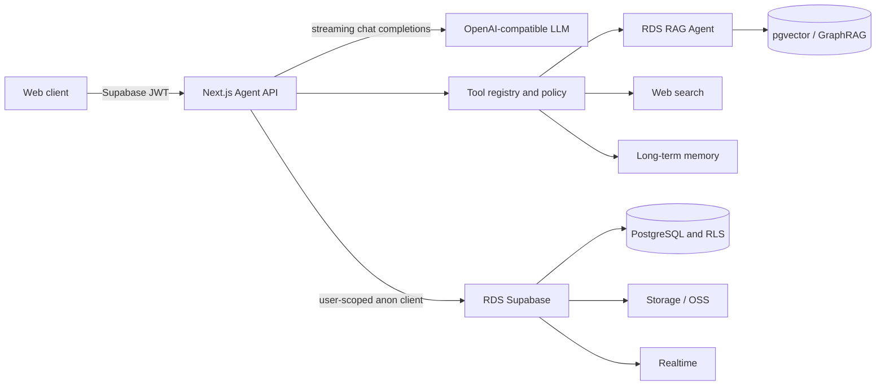

# Architecture

The application deliberately separates the agent runtime from Alibaba Cloud RDS AI Application Platform. RDS Supabase is the durable capability layer; the Next.js service owns orchestration and policy.

## Responsibility split

| Layer | Responsibility |
| --- | --- |
| Supabase Auth + RLS | Identity, tenant isolation, and least-privilege access |
| PostgreSQL | Conversations, messages, runs, steps, memories, approvals, audit data |
| Storage | Private user files and generated artifacts |
| Realtime | Durable run status and background progress notifications |
| RAG Agent / pgvector | Document processing and grounded retrieval |
| mem0 | Optional cross-session memory service; ordinary conversation history stays in app tables |
| Sandbox | Optional execution of untrusted code; never run model-authored shell commands in the web process |
| Edge Functions | Small webhooks and lightweight tool adapters, not the long-running orchestration loop |
| Agent runtime | Model loop, tool validation, timeouts, retries, cancellation, budget, audit, streaming |

## Trust boundaries

1. The browser receives only the Supabase URL and AnonKey.
2. Every API call carries a Supabase access token. The server verifies it with Supabase Auth and creates an anon client bound to that JWT, so RLS remains active.
3. Every repository operation also includes an explicit `user_id` predicate. This is defense in depth, not a replacement for RLS.
4. `SUPABASE_SERVICE_ROLE_KEY` is reserved for administrative jobs and RAG management. Ordinary chat traffic does not need it.
5. Tool parameters are schema-validated. Tools have timeouts and isolated failures; the model cannot execute arbitrary SQL, shell commands, or arbitrary URLs.
6. RAG calls request context only. The primary model remains responsible for the final response and can cite the returned evidence.

## Streaming model

`POST /api/chat` uses Server-Sent Events. Events are typed and include lifecycle, text delta, tool call, tool result, token usage, completion, and error signals. The client may cancel the request; cancellation propagates to the model and active tool.

The agent loop is bounded by both a request timeout and a maximum number of tool rounds. A tool error is returned to the model as structured data so one failed optional capability does not corrupt the conversation.

## Production topology

Place the application service in the same Alibaba Cloud region and VPC as the RDS AI project. Prefer the internal Supabase/RAG endpoint. Terminate HTTPS at a trusted load balancer or enable the RDS AI endpoint certificate before exposing traffic. Add only application egress addresses to the whitelist and never use `0.0.0.0/0` in production.

For long jobs, split the Agent API and worker behind a durable queue. The included runtime is stateless between streamed requests; all durable state belongs in RDS Supabase.
