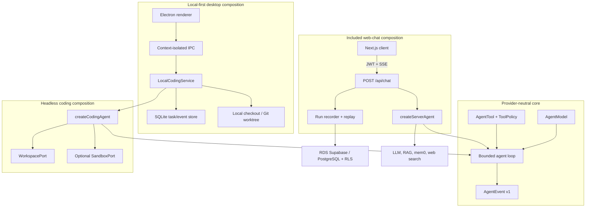
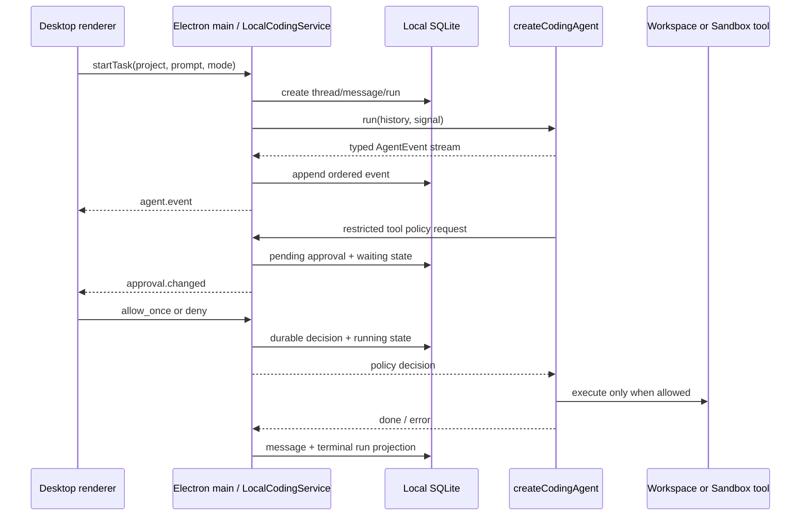
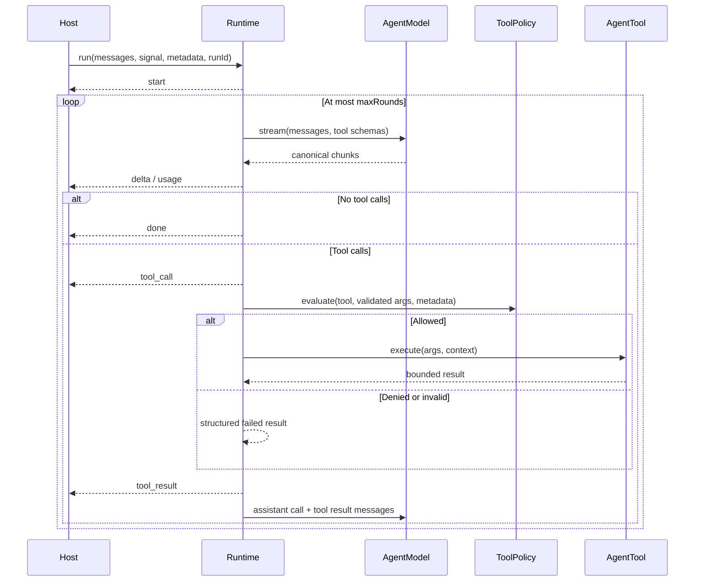
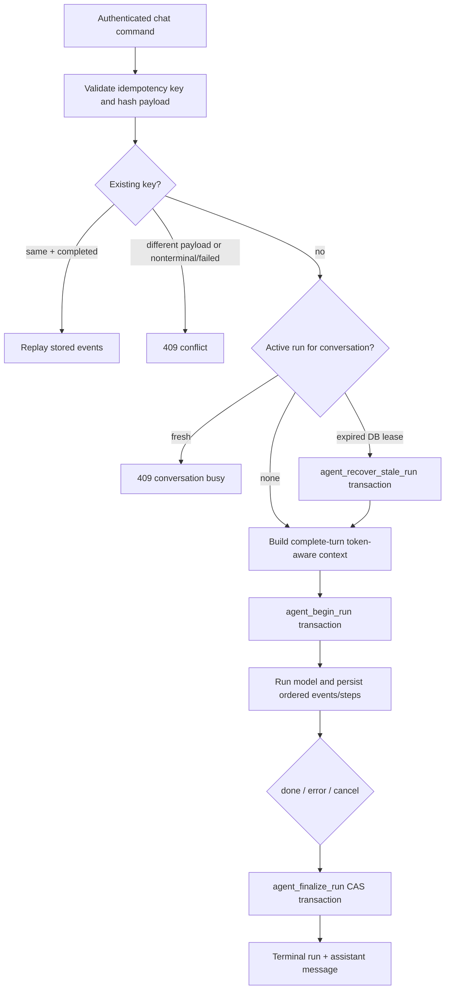
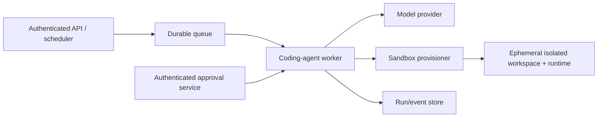

# Architecture

Brace separates a provider-neutral execution core from capability adapters and product-specific composition roots. The core powers a headless coding agent without Supabase or Next.js. The desktop product adds local projects, SQLite, worktrees, approvals, and Electron IPC; the web product adds authenticated cloud persistence, replay, and optional RDS AI integrations.

## System shape



There are three independent composition roots:

| Composition | Intended host | Mounted capabilities |
| --- | --- | --- |
| `createCodingAgent` | CLI, worker, IDE, or another trusted host | Workspace reads and optimistic writes; optional command and fixed Git tools; optional host-supplied tools |
| `LocalCodingService` | Electron main process or another trusted local client | Local projects/threads, SQLite events, interactive approvals, cancellation, checkout/worktree selection, coding tools |
| `createServerAgent` | Included authenticated Next.js chat route | Time, calculator, user memory, and configured web/RAG integrations |

The web route deliberately does **not** mount `NodeWorkspace`, `NodeProcessSandbox`, or any local code tool. A deployment that exposes coding through HTTP must create a separate, tenant-isolated workspace/sandbox composition.

## Layer responsibilities

| Layer | Code | Responsibility |
| --- | --- | --- |
| Core domain/runtime | `src/lib/agent/{runtime,tool-executor,types,errors}.ts` | Model loop, canonical stream chunks, typed events, limits, validation, authorization, scheduling, cancellation, error normalization |
| Model transport adapter | `src/lib/agent/{model,openai-sdk,model-probe,stream-supervisor}.ts` | OpenAI-compatible wire conversion, SDK isolation, capability probing, retry supervision |
| Shared model registry | `src/lib/model-providers.ts` | Provider capabilities, endpoint policy, credential scopes, probe budgets, and host request options shared by desktop and web |
| Capability contracts | `src/lib/workspace/types.ts`, `src/lib/sandbox/types.ts`, `src/lib/tools/{types,registry}.ts` | Environment-neutral filesystem/process/tool interfaces and effect metadata |
| Local capability adapters | `src/lib/workspace/node-workspace.ts`, `src/lib/sandbox/node-process-sandbox.ts` | Node filesystem and process integration |
| Coding composition | `src/lib/coding-agent` | Protected coding prompt, stable tool set, exact-name effect policy |
| Local application service | `src/lib/local-agent` | Desktop projects, task lifecycle, SQLite, approval coordinator, managed worktrees, model/workspace/sandbox composition |
| Desktop client | `desktop` | Sandboxed renderer, narrow preload bridge, native folder selection, task/diff/approval UI, and a loopback-only center Web preview |
| Web application | `src/server/agent`, `src/server/chat`, `src/app/api/chat` | Authenticated command handling, context selection, server tools, persistence, replay, SSE transport |
| Durable capability layer | RDS Supabase | Auth, RLS, conversations, messages, runs, steps, ordered events, memories, audit, private Storage |
| Optional managed services | RAG Agent, mem0, web search | Evidence retrieval and curated cross-session memory |

The core has no dependency on Next.js, Supabase, a host filesystem, or process environment. Model- and capability-specific failures are converted into stable public event errors at the boundary.

### Dependency rules

Dependencies point inward: product hosts compose application services, application services compose the coding agent, and the coding agent depends only on the runtime plus capability contracts. Core and capability modules never import a host or product layer.

`index.ts` files are public composition surfaces. Internal modules use leaf imports such as `tools/types`, `workspace/types`, or `sandbox/types`; this prevents a contract import from also loading Node adapters or unrelated tools. ESLint enforces these boundaries for the agent core, coding composition, coding tools, and desktop configuration.

## Local desktop lifecycle

The Electron renderer never receives Node.js integration, a model key, or a Supabase Service Role key. Its context-isolated preload exposes a fixed IPC command surface and a whitelisted native-menu event channel. The Electron main process validates every command before calling `LocalCodingService`. Provider URL and model settings are stored in the application data directory; the API key is encrypted and decrypted only by Electron `safeStorage` (macOS Keychain on the macOS build). The renderer receives only non-secret presence/source metadata for the key.

The packaged desktop binary also disables Electron's Run-as-Node, `NODE_OPTIONS`, and CLI-inspection fuse paths, enables cookie encryption and embedded ASAR validation, and restricts startup code to `app.asar`. The file-protocol privilege fuse remains enabled because the context-isolated renderer is intentionally loaded from the packaged `file://` document. On macOS, fuse changes are applied before a complete bundle signature and strict signature verification.



On startup, any run left in `running` or `waiting_for_approval` is marked failed and any pending approval is cancelled. The application preserves its event and decision history, but it does not silently replay a side effect after a crash.

Approval registration is cancellation-safe: the pending decision is installed before the abort listener becomes observable, and the signal is checked again after listener registration. Cancellation during that boundary therefore resolves and persists the approval as cancelled instead of leaving the task or service shutdown waiting on an orphaned promise.

Local tasks can operate on the selected checkout or create a named `brace/<project>/<thread>` Git worktree branch below the operating system's application data directory. Worktree mode requires the selected project to be the clean Git repository root. The current desktop host permits one active task per project and reserves that project synchronously before asynchronous workspace setup; this closes duplicate-submit races while still allowing different projects to run independently.

The desktop service reports in-flight work from both persisted active runs and asynchronous setup/cleanup operations that do not yet have a run ID. Window-close confirmation and model-settings replacement use that complete state instead of the renderer snapshot's `activeRunIds`. Reconfiguration temporarily removes the old service from the IPC path, drains it, updates settings, and creates a replacement in `finally`, so a concurrent start cannot slip into the handoff or be cancelled by it.

The Inspector exposes the managed branch, dirty state, and commit distance. Applying a task requires an explicit native confirmation, verifies the recorded base, requires a clean and unchanged main checkout, rejects ignored files and submodule/gitlink changes that a binary patch cannot preserve, captures tracked and untracked task changes in the managed branch, applies them back as an uncommitted project patch, reverse-checks the result, and then removes the managed worktree/branch. Discard also requires explicit confirmation and force-removes only the expected managed branch. Path, symlink, repository-identity, dirty-state, unmerged-commit, branch-identity, and unmanaged-prune checks fail closed. If the project patch succeeds but cleanup fails, the applied commit is persisted separately; a restart-safe cleanup retry first proves that the exact task patch is present in the main project before compare-and-delete removal of the managed branch.

### Local Web preview boundary

The desktop renderer can replace the center task timeline with a real iframe preview. The toolbar, the native **View → Toggle Local Preview** menu item, and `Cmd/Ctrl+Shift+P` all toggle that surface. Hiding it returns to the timeline while leaving the current page running; the preview close control explicitly unloads the iframe. The renderer stores the last validated address under a project-scoped local key, so switching projects restores the relevant address without automatically loading it.

The operator must start the project's local development server before opening the preview. Brace neither discovers nor launches a dev-server command. The accepted top-level address is limited to `http://localhost[:port]/...` or `http://127.0.0.1[:port]/...`; credentials, other schemes, and lookalike hosts are rejected.

The boundary is enforced at several layers:

- the renderer's CSP allows frames only from the two loopback hostnames;
- the preload and main process share exact URL parsing instead of prefix matching;
- `will-frame-navigate` and `will-redirect` prevent the preview frame from leaving the loopback allowlist;
- `setWindowOpenHandler` rejects popups and new windows;
- the iframe sandbox allows scripts, same-origin behavior, and forms, but does not grant popup, top-navigation, or download capabilities;
- Electron permission request and permission check handlers deny browser permissions;
- failed loads, blocked navigation, and a renderer timeout are projected into the preview error state, where the operator can retry. Refresh reloads the current address; stop unloads the iframe while preserving the project address.

This allowlist governs document navigation, not every subresource initiated by the loaded local page. The previewed application's `fetch`, image, and script traffic remains subject to its own response CSP, normal browser CORS behavior, and its backend's policy. Supabase and other remote API calls therefore remain available when the local application is configured to use them; flows that require a popup or navigation to an external identity provider are still blocked by the preview boundary.

## Provider-neutral agent core

`AgentModel` receives canonical messages, tool definitions, temperature, and adapter options, and returns an async iterable of canonical `AgentModelChunk` values. `OpenAICompatibleModel` is the included adapter; another provider can implement the same port without changing the loop.

### Model registry and credential boundary

The desktop model registry is a configuration layer above `AgentModel`, not provider-specific logic inside the agent loop. Every current preset ultimately creates the same OpenAI-compatible Chat Completions client. Native Anthropic Messages, provider SDK extensions, and provider-specific tokenizers require separate adapters behind `AgentModel`; choosing a preset does not emulate another coding client or protocol. Provider descriptors own request capabilities such as prompt caching and capability-probe budgets, while both desktop and web composition roots call the same request-option builder instead of branching on provider IDs.

| Provider ID | Credential scope | Endpoint policy |
| --- | --- | --- |
| `bailian-payg` | `bailian-cn-payg` plus endpoint suffix for another region | Default China pay-as-you-go endpoint; recognized official regional endpoints are editable |
| `bailian-coding-plan` | `bailian-cn-coding-plan` plus endpoint suffix for another region | Default China Coding Plan endpoint; recognized official regional endpoints are editable |
| `minimax-cn-token-plan` | `minimax-cn-token-plan` | Fixed MiniMax China Token Plan endpoint |
| `minimax-global-token-plan` | `minimax-global-token-plan` | Fixed MiniMax Global Token Plan endpoint |
| `kimi-code` | `kimi-code-membership` | Fixed Kimi Code membership endpoint |
| `deepseek` | `deepseek-payg` | Fixed DeepSeek open-platform endpoint |
| `glm-payg` | `glm-payg` | Fixed GLM pay-as-you-go endpoint |
| `glm-coding-plan` | `glm-coding-plan` | Fixed GLM Coding Plan endpoint |
| `custom` | `openai-default` for the default OpenAI URL; otherwise `custom:<origin><path>` | Operator-editable compatible endpoint |

Most presets resolve to the registry's exact endpoint. Bailian presets additionally accept an operator URL only when endpoint inference maps it back to the same provider/plan; all unrelated substitutions are rejected. `custom` accepts an operator-selected compatible URL. The shared URL schema:

- requires HTTPS for remote endpoints;
- permits HTTP only for loopback hostnames (`localhost`, `*.localhost`, `127.0.0.0/8`, and `::1`);
- rejects embedded usernames/passwords, query parameters, and fragments;
- removes trailing slashes before deriving a custom credential scope.

This is a shared model-endpoint policy, not a network sandbox: an accepted HTTPS custom endpoint is still operator-selected network access.

Desktop settings are persisted as a V3 record containing provider ID, an optional normalized endpoint override, editable model ID, encrypted key bytes, and credential scope. V1/V2 endpoint/model/key records are migrated on read, including recognized legacy regional endpoints. The main process decrypts keys through Electron `safeStorage`; the renderer receives only whether a key exists and whether it came from secure storage or the environment. A decrypt result is cached only in main-process memory for that process lifetime, and macOS Keychain availability is not probed during ordinary renderer refreshes. This prevents repeated prompts inside one run without weakening at-rest encryption; a stable signed release identity is still required for durable Keychain trust across rebuilt bundles.

Credential scope is the invariant that prevents cross-provider secret reuse. Pay-as-you-go and subscription-plan products, MiniMax regions, and distinct custom endpoints do not share scopes. Keeping a saved key is allowed only when the new selection resolves to the same scope. A scope change requires a new key or explicit key removal, and a process-environment key is considered only when the environment configuration resolves to that same scope.

The settings connection test resolves the candidate without writing it, builds the same provider-profiled model adapter used by a task, and requests one no-side-effect streamed function call with a timeout capped at 30 seconds. The probe reserves at least 1,024 output tokens (4,096 for Kimi), deliberately removes a forced `tool_choice` for thinking-model compatibility, assembles fragmented call names and arguments, validates the exact probe tool/payload, and requires `finish_reason=tool_calls`. An endpoint that can stream text but cannot produce coding-agent tool calls therefore fails the test. Saving settings is blocked while a local task is active; after a save, the local service is recreated with the new model configuration.

Recommended model IDs are UI suggestions rather than validation rules. This avoids coupling application releases to provider catalog changes, but the provider remains responsible for model entitlement and compatibility. Plan keys and standard open-platform keys are intentionally treated as different products. In particular, GLM states that Coding Plan benefits apply only to its officially supported designated tools: the compatible endpoint can be configured here, but Brace cannot guarantee plan-quota eligibility. Bailian Coding Plan is likewise documented for interactive coding-tool use rather than general backend or batch workloads, and Kimi Code integration preserves Brace's real client identity.

A run follows this bounded sequence:



The runtime enforces independent limits for:

- model rounds;
- cumulative tool calls;
- concurrent tool executions;
- per-tool time;
- raw tool-argument bytes;
- serialized tool-result bytes.

It reconstructs fragmented tool calls, normalizes duplicate/missing call IDs, validates arguments through the tool's Zod schema, and derives the advertised JSON Schema from that same schema. Tools sharing a `concurrencyKey` are serialized; other calls run in a bounded pool. Cancellation propagates to the model and tool context.

OpenAI-compatible profiles adapt only wire-level differences: MiniMax/Kimi output-token parameters, Qwen streamed usage, GLM streamed tool output, and provider-specific optional fields. The official SDK is wrapped once behind the narrow chat-completions transport; SDK retries are disabled so `ModelStreamSupervisor` is the sole retry owner. `reasoning_content` is normalized and retained on assistant tool-call sub-rounds for DeepSeek/Kimi compatibility. Only semantically matching `stop` and `tool_calls` finishes complete normally; truncation, filtering, and provider-resource finish reasons become explicit terminal errors.

Stream retries use an attempt commit boundary. Before non-empty assistant content becomes externally visible, hidden reasoning, tool-call fragments, usage, and finish chunks are retained in a bounded attempt buffer. A transport failure discards that buffer and safely retries without combining fragments from different attempts. Publishing content commits the attempt, after which an interruption is reported rather than replaying visible output. The buffer itself is capped by bytes and chunk count; crossing either bound commits in order and disables retry instead of allowing unbounded memory growth.

When `contextWindowTokens` and `reservedOutputTokens` are configured, the runtime estimates the serialized messages, tool definitions, reasoning, request options, and output reserve before every model request. If needed it removes only the oldest whole historical turn, including all assistant/tool children belonging to that turn. It never splits the current tool-call sub-round; if that sub-round still cannot fit, it emits `context_window_exceeded` without opening a provider stream.

The runtime snapshots the supplied registry at construction. Omitting tools means no tools; the core never silently installs defaults.

### Event protocol

Every `AgentEvent` envelope contains:

- `protocolVersion: 1`;
- a positive, monotonically increasing `sequence` within the run;
- ISO `timestamp` and stable `runId`;
- one of `start`, `delta`, `tool_call`, `tool_result`, `usage`, `done`, or `error`.

SSE frames carry both `id: <sequence>` and `event: <type>`, followed by the JSON envelope. A terminal `[DONE]` frame ends the transport. Heartbeats are SSE comments and are not part of the durable event sequence. The shared decoder validates event shape instead of silently accepting malformed frames.

## Coding capabilities

### WorkspacePort

`WorkspacePort` exposes six operations without assuming a local filesystem:

| Tool | Effect | Behavior |
| --- | --- | --- |
| `list_files` | `read` | Bounded recursive listing below a relative path |
| `search_code` | `read` | Bounded literal search across UTF-8 text files |
| `read_file` | `read` | Bounded UTF-8 file read |
| `apply_patch` | `write` | Atomic full-content replace/create with optimistic content matching |
| `delete_file` | `write` | Delete one regular file after exact content matching |
| `move_file` | `write` | Move/rename one regular file after exact content matching, without overwriting |

`NodeWorkspace` canonicalizes a configured root, rejects absolute and parent paths, refuses observed symlink traversal, hides common credential paths (`.env`, `.npmrc`, `.git`, private-key formats, and similar) by default, ignores build/dependency directories during recursive walks, rejects binary/oversized reads, caps serialized output, and uses atomic filesystem replacement. Existing-file replacement, deletion, and movement require an exact `expectedContent` match. Writes lock every affected path in stable order, so stale replacements, deletes, and crossing moves cannot both succeed. Move destinations must not exist. A trusted local host may explicitly set `allowSensitivePaths`, but an untrusted or remote model must not receive that capability.

The name `apply_patch` describes the agent operation, but the current contract is a full-content optimistic replacement rather than a unified-diff interpreter.

The pure-Node move adapter reserves the destination with a no-overwrite hard link and then removes the source. It therefore requires hard-link support on the same filesystem; a process crash between those steps can leave both names pointing to the same file. It never silently falls back to a copy-and-delete move.

`NodeWorkspace` is a confinement adapter, not a kernel security boundary. Portable Node path checks cannot prevent a concurrent process from swapping an already-checked intermediate directory before a later `open`, `readdir`, `link`, or `rename`. A malicious process with the service's OS identity is outside this port's protection; production tenants need a container/VM/managed workspace or a platform primitive equivalent to descriptor-relative `openat2(RESOLVE_BENEATH)`.

### SandboxPort

`SandboxPort` accepts one executable, a separate argument vector, a workspace-relative working directory, timeout, and cancellation signal. There is intentionally no shell-string API.

When a sandbox is supplied, `createCodingAgent` adds:

- `run_command`, with effect `execute`;
- `git_status` and `git_diff`, with effect `execute`, exact-name approval, fixed Git argument lists, disabled external diff/textconv, and repository fsmonitor/untracked-cache execution disabled.

`NodeProcessSandbox` is a trusted local/development adapter. It:

- denies every executable by default and matches the configured allowlist exactly;
- runs `spawn(executable, args)` with `shell: false`;
- resolves and confines the working directory, including symlink targets;
- copies only allowlisted environment variables (`PATH`, `LANG`, and `LC_ALL` by default);
- enforces timeout, cancellation, and a combined stdout/stderr cap;
- attempts to terminate the process group when a run ends early.

These controls reduce accidents and command injection, but they do not provide tenant isolation, syscall/filesystem isolation, network policy, quotas, or secret isolation. `NodeProcessSandbox` must not execute untrusted multi-tenant workloads. Production hosts should implement `SandboxPort` with an ephemeral container, VM, or managed sandbox and bind a separately isolated `WorkspacePort` to the same run.

`run_command` treats a normal process exit, including a non-zero exit code, as structured diagnostic output for the model. Sandbox timeout, cancellation, and output-limit terminations are converted into explicit tool failures rather than successful command results. Stable sandbox error codes are preserved in safe tool-error details without exposing the host workspace root.

## Tool effects and authorization

Tool annotations are trusted control-plane metadata:

```ts
type ToolEffect = "read" | "write" | "execute" | "network";

interface ToolAnnotations {
  effect: ToolEffect;
  idempotent?: boolean;
  requiresApproval?: boolean;
  concurrencyKey?: string;
}
```

Descriptions and tool arguments are model-controlled and never determine authorization. If no policy is configured, the runtime denies tools marked `requiresApproval`; other tools execute after validation. Asynchronous schema validation is bounded by the tool timeout and observes run cancellation. A validator that throws, rejects, or times out becomes a failed result for that call and does not terminate sibling calls or the model loop; only cancellation of the enclosing run crosses that boundary. If a policy throws, evaluation fails closed.

The coding composition replaces caller attempts to override its prompt, tools, or policy. Its policy is:

| Effect | Default | How to allow |
| --- | --- | --- |
| `read` | Allowed | No run metadata required |
| `write` | Denied | Exact tool name in `metadata.approvedTools` |
| `execute` | Denied | Exact tool name in `metadata.approvedTools` |
| `network` | Denied | Exact tool name in `metadata.approvedTools` |
| Missing/untrusted annotation | Denied | Define a trusted effect before registration |

For example, `metadata: { approvedTools: ["apply_patch"] }` permits only that named write tool. Booleans, wildcard strings, similar names, and unrelated metadata do not grant access.

Exact-name metadata is **preauthorization**, not a model-controlled approval. The desktop host adds a separate durable request/decision state machine above the core through `interactiveToolPolicy`; other embedding hosts must either construct `approvedTools` outside model-controlled payloads or inject an equivalent trusted policy.

Exact-name authorization is tool-level, not argument-level. Approving `run_command`, for example, allows any executable and argv accepted by the injected `SandboxPort`. The host must keep that adapter's allowlist narrow or add a policy that evaluates arguments. Likewise, host-supplied `extraTools` and their effect annotations are trusted code; a sensitive capability mislabeled as `read` becomes ambient.

The web-chat composition uses a different policy. Its memory write tool is allowed only when the original user message matches a narrow explicit-save intent parser, and the tool repeats the check before writing. This guardrail is not the coding policy and is not a general approval mechanism.

## Web command and durable run lifecycle

`POST /api/chat` is an authenticated application adapter, not part of the core runtime. It verifies the Supabase access token with an AnonKey/JWT client, creates a separate server-only Service Role data client, parses the command, and resolves a caller-provided idempotency key. Every repository call still carries and filters the verified `user_id`; the privileged key is never exposed to the browser.



Migration `003_run_events_and_consistency.sql` supplies the consistency primitives:

- `heartbeat_at` on `agent_runs`;
- a partial unique index allowing one `queued`, `running`, or `requires_action` run per user/conversation;
- append-only `agent_run_events` keyed by `(run_id, sequence)`, with an owner foreign key and RLS; token events are deliberately excluded from per-row audit write amplification;
- `agent_begin_run`, which inserts the running run and user message in one database transaction;
- `agent_append_run_events`, which row-locks the active lease and makes identical event batches retry-safe;
- `agent_recover_stale_run`, which uses database time plus a row lock to fence an expired lease and atomically project its failure;
- `agent_finalize_run`, which compare-and-sets an active run and writes its terminal event, unfinished steps, terminal projection, and assistant message in one transaction;
- a message trigger that updates conversation activity.

Migration 003 revokes application-table DML from `authenticated` and grants the narrow run RPCs only to `service_role`. The API passes the verified owner ID to every repository and filters every operation by `user_id`. Supabase's Service Role bypasses RLS, so those explicit predicates and RPC owner checks—not RLS—are the isolation boundary for privileged server calls. RLS remains enabled for any separately granted authenticated access.

### What is atomic, and what is not

The begin pair (run + user message) and terminal projection (terminal event + run + unfinished steps + assistant message) are transactional. The partial unique index arbitrates concurrent starts, database-time lease recovery is row-locked, and terminal update predicates prevent two finalizers from winning. Identical finalize retries are safe after an ambiguous network response.

The model call, nonterminal event batches, heartbeats, and completed run-step updates occur over time and cannot share one database transaction. Consecutive durable deltas are coalesced; lifecycle boundaries flush the buffer. The stream starts an internal producer that advances the agent and records each event before placing its SSE frame into a bounded outbound queue; `ReadableStream.pull()` only transfers queued frames. Lease heartbeats run on their own timer even during continuous deltas or transport backpressure, and a failed heartbeat aborts a worker that has lost its lease. Abort, cancellation, source failure, and normal terminal events share one idempotent finalization path. A process crash can still leave a stale run for the database recovery RPC. This is an event log plus terminal projection, not a distributed transaction across the LLM and database.

### Replay and idempotency

An idempotency key is scoped to the authenticated user. Reusing it with a different conversation or message hash is rejected. A matching completed run is replayed only when stored events form an ordered valid stream beginning with `start` and ending with `done`; older or corrupt logs fall back to a synthetic start/delta/done projection from the terminal run output.

There is no live stream reattachment for an in-progress run. A retry while a matching run is active receives a conflict rather than tailing the event table.

### Tool-step projection

`tool_call` creates a running `agent_run_steps` row keyed in memory by `(round, callId)`. `tool_result` completes or fails it with duration/output metadata. The terminal RPC marks every outstanding step failed or cancelled in the same transaction as run finalization. The ordered `agent_run_events` table remains the protocol-level replay source; run steps are a query-friendly projection.

## Token-aware context

The web context builder does not send arbitrary last-N rows. It scans stored messages into complete successful user/assistant turns, excludes stopped assistant attempts, orphan user rows, tools, and system rows, and selects newest complete turns without splitting one. The desktop builder uses a bounded recent-message query and writes a synthetic assistant completion for failed, cancelled, or crash-recovered runs so the user's prior instruction remains explicit without implying success. Root `AGENTS.md` and `CLAUDE.md` are loaded through `WorkspacePort` with a combined UTF-8 byte cap, ignore missing/denied/symlinked files, and are placed below host policy and user authority.

Initial selection stops at both `AGENT_MAX_HISTORY_MESSAGES` and a token budget:

```text
available history = context window - system prompt - new user message - output reserve
```

The output reserve is the smaller of `LLM_MAX_OUTPUT_TOKENS` and half the configured context window. The initial estimate is `ceil(UTF-8 bytes / 3)` plus per-message overhead; the core then performs the stricter per-round serialized estimate described above. Both are conservative for mixed Chinese/code and independent of any provider tokenizer; exact provider token accounting remains an adapter-level extension.

## Supabase responsibilities and trust boundary

Supabase is the optional cloud control plane, not a dependency of local desktop execution. The current desktop client keeps repositories, task threads, high-frequency events, terminal output, and approval state on the machine. The existing Next.js BFF continues to own Service Role access for web/cloud data. A future sync adapter should send authenticated, user-selected projections through that BFF or narrowly scoped authenticated RPCs; it must not copy `SUPABASE_SERVICE_ROLE_KEY` into Electron.

| Component | Responsibility |
| --- | --- |
| Supabase Auth + RLS | Identity, owner isolation, and least-privilege row access |
| PostgreSQL | Conversations, messages, runs, steps, ordered events, memories, and append-oriented audit records |
| Storage | Optional private user files and generated artifacts |
| Realtime | Available for durable background status; not used in the token SSE hot path |
| RAG Agent / pgvector | Server-allowlisted document retrieval returned as untrusted evidence |
| mem0 | Optional curated cross-session memory; chat history stays in application tables |

Primary trust rules:

1. The browser receives only the Supabase URL and AnonKey.
2. The server verifies the access token with Supabase Auth; decoded claims alone are not trusted.
3. The AnonKey/JWT client is used only to verify identity. Business-table reads/writes use a server-only Service Role client, and repositories add explicit owner predicates.
4. `SUPABASE_SERVICE_ROLE_KEY` is required by the web API, denied to browser bundles, and must be stored in the deployment secret manager. Migration 003 revokes direct authenticated business-table DML.
5. RAG dataset IDs and tenant/user identifiers come from server configuration/authentication, never from model-selected arguments.
6. Retrieved code, web pages, documents, memories, and tool output are untrusted data. They cannot grant tools or replace system policy.
7. Secrets belong in the deployment secret manager. Sandbox credentials and network access must be scoped outside the model process.

## Health model

The service separates process health from dependency availability:

| Endpoint | Meaning | Dependencies | Failure status |
| --- | --- | --- | --- |
| `GET /api/health` | Liveness | None | Normally always `200` while the process can serve requests |
| `GET /api/health/ready` | Readiness | Parsed configuration, Supabase Auth health, Service Role access to migration 003's event table, model `GET /models` | `503` when configuration or any probe fails |

Use liveness for process restart decisions and readiness for traffic admission. Some OpenAI-compatible providers do not implement `/models`; those deployments should replace or extend the model probe rather than weakening liveness semantics.

## Production topology

Place the web application in the same Alibaba Cloud region and VPC as the RDS AI project. Prefer internal Supabase/RAG endpoints, terminate HTTPS at a trusted load balancer, restrict project whitelists to application egress addresses, and never use `0.0.0.0/0` in production.

For a production coding-agent service, add an execution control plane next to the existing web topology:



The queue, sandbox provisioner, per-run checkout lifecycle, credential broker, network policy, resource quotas, and interactive approval service in this diagram are production extensions, not included implementations.

## Explicit non-goals and current limits

- The included web route has no interactive approval UI, durable approval table, or pause/resume approval protocol; the local desktop composition implements all three in SQLite.
- No in-progress SSE reattachment; only completed-run replay.
- No managed container/VM provisioner or multi-tenant code-execution isolation.
- No local workspace or command capability in the included web route.
- No unified-diff interpreter; `apply_patch` performs optimistic full replacement/create.
- No durable background queue for runs longer than the request/stream lifetime.
- No exact provider tokenizer in the shared context builder.
- Readiness assumes an OpenAI-compatible `/models` endpoint unless adapted.

These boundaries are intentional: the repository delivers a coding-agent core and safe capability interfaces without claiming that an in-process Node adapter is a production sandbox.
